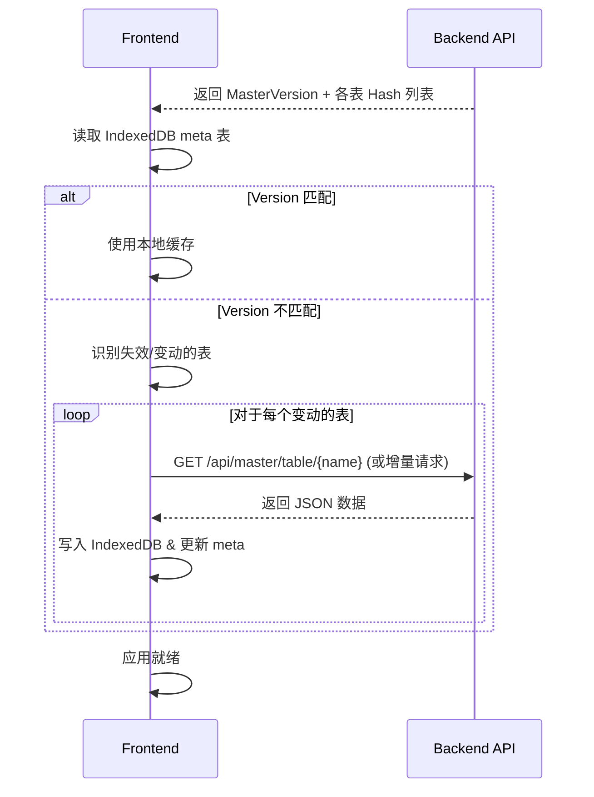

# 架构方案：基于 IndexedDB 的 Master 数据解析系统 (ARCH-001 v2)

## 1. 目标
解决 Master 数据量大、频繁访问导致的性能问题，并确保在游戏版本更新时前端数据能自动同步，解决“过期数据”问题。

## 2. 核心机制：IndexedDB 持久化与版本校验

### 2.1 存储结构 (Browser)
使用 **IndexedDB**（建议库：`Dexie.js`）作为本地缓存层。
- **`meta` 表**: 存储全局元数据，如 `currentMasterVersion`。
- **`master_tables` 表**: 存储各张表的状态。
  - 字段: `tableName`, `hash`, `lastUpdated`, `isFullLoaded`。
- **`master_data` 表**: 存储具体的记录。
  - 字段: `table_id` (复合主键: `tableName + id`), `data` (JSON 对象)。

### 2.2 同步逻辑流程图



## 3. 详细设计

### 3.1 后端接口增强
- **`GET /api/master/manifest`**: 
  返回当前所有可用表的元数据。
  ```json
  {
    "version": "1.10.0",
    "tables": [
      { "name": "CharacterTable", "hash": "a1b2...", "count": 250 },
      { "name": "MissionTable", "hash": "c3d4...", "count": 1500 }
    ]
  }
  ```
- **`GET /api/master/table/{name}`**: 
  返回全表 JSON。针对特大表，可支持分页或压缩传输（Gzip/Brotli）。

### 3.2 前端数据访问层 (DAL)
- **`MasterManager`**: 封装 IndexedDB 操作。
  - `getById(table, id)`: 先查内存缓存 -> 再查 IndexedDB -> (未命中) -> 发起后台请求。
- **`useMasterData(table, id)` Hook**: 封装状态管理，提供响应式更新。

### 3.3 缓存失效策略
- **全量失效**: 当 `MasterVersion` 发生重大变更（如游戏大版本更新），清空所有 `master_data` 重新同步。
- **增量更新**: 基于 `master-catalog` 的哈希值，仅重新下载发生变化的表。

## 4. 优化点：针对“特大表”的特殊处理
- **延迟加载**: 某些表（如文本资源）可能极大。可以将 `TextResource` 拆分为多语言包，仅在切换语言时下载。
- **Web Worker**: 将数据解压和写入 IndexedDB 的过程放入 Web Worker，避免阻塞渲染主线程（防止页面在同步数据时卡死）。

## 5. 开发建议
1.  **后端**: 在 `MasterDataService` 同步完二进制 MB 后，预生成一份 JSON 缓存到内存或磁盘，提高 API 响应速度。
2.  **前端**: 
    - 使用 `pnpm generate-types` 生成的 TypeScript 类型，配合 Dexie 的泛型支持，确保强类型。
    - 在登录页面或加载页面展示“正在同步游戏配置...”的进度条。

## 6. 待确认
1. 是否有某些表的大小超过了 IndexedDB 的常规性能限制（如超过 50MB）？如果存在，需要考虑流式处理。
