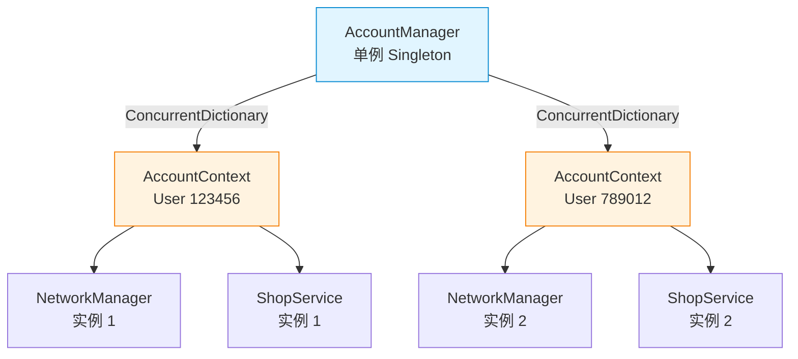
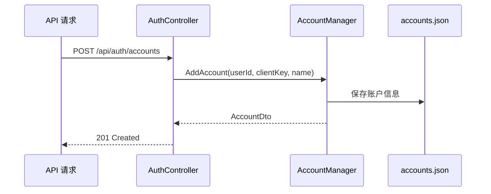
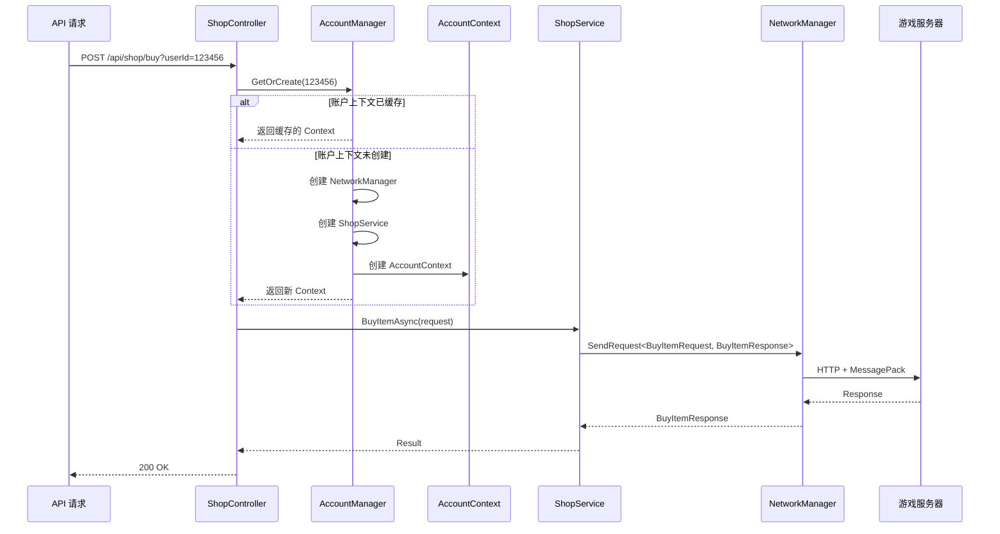

# API 版本多账户管理架构

## 核心设计

### 与 Blazor 版本的对比

| 特性 | Blazor 版本 | API 版本 |
|------|------------|----------|
| 账户管理器 | `AccountManager` 单例 | `AccountManager` 单例 |
| 账户缓存 | `ConcurrentDictionary<long, Account>` | `ConcurrentDictionary<long, AccountContext>` |
| NetworkManager | 每个账户独立实例（瞬态服务） | 每个账户独立实例（手动创建） |
| 业务服务 | `MementoMoriFuncs`（瞬态服务） | 各个 Service（手动创建） |
| 依赖注入 | 复杂的 DI 容器管理 | 简化的手动创建 |
| 账户持久化 | `IWritableOptions<AuthOption>` | 文件（accounts.json） |

### 架构图



## 核心组件

### 1. AccountManager（账户管理器）

**职责：**
- 管理所有账户的生命周期
- 缓存账户上下文（AccountContext）
- 按需创建账户的业务实例
- 账户信息的持久化

**注册方式：**
```csharp
// Program.cs
builder.Services.AddSingleton<AccountManager>();
```

**核心方法：**
```csharp
public class AccountManager
{
    // 获取或创建账户上下文（线程安全）
    public AccountContext GetOrCreate(long userId)
    
    // 获取所有账户信息
    public List<AccountDto> GetAllAccountInfos()
    
    // 添加账户
    public AccountDto AddAccount(long userId, string clientKey, string name)
    
    // 删除账户
    public void DeleteAccount(long userId)
}
```

### 2. AccountContext（账户上下文）

**职责：**
- 封装单个账户的所有业务实例
- 确保每个账户的数据隔离

**结构：**
```csharp
public class AccountContext
{
    public AccountDto AccountInfo { get; set; }
    public NetworkManager NetworkManager { get; set; }
    
    // 后续添加其他业务服务
    public ShopService ShopService { get; set; }
    public MissionService MissionService { get; set; }
    public CharacterService CharacterService { get; set; }
    // ...
}
```

### 3. Controller 使用方式

**方式 1：通过请求参数指定账户**
```csharp
[HttpPost("shop/buy")]
public async Task<ActionResult> BuyItem(
    [FromQuery] long userId,  // 指定操作哪个账户
    [FromBody] BuyItemRequest request)
{
    // 获取该账户的上下文
    var context = _accountManager.GetOrCreate(userId);
    
    // 使用该账户的业务实例
    var result = await context.ShopService.BuyItemAsync(request);
    
    return Ok(result);
}
```

**方式 2：通过 Header 指定账户**
```csharp
[HttpPost("mission/complete")]
public async Task<ActionResult> CompleteMission([FromBody] CompleteMissionRequest request)
{
    // 从 Header 获取用户 ID
    var userId = long.Parse(Request.Headers["X-User-Id"]!);
    
    var context = _accountManager.GetOrCreate(userId);
    var result = await context.MissionService.CompleteAsync(request);
    
    return Ok(result);
}
```

## 数据流程

### 账户创建流程



### 账户操作流程



## 实现细节

### 服务创建策略

**不通过 DI 注册的服务（每账户独立）：**
- `NetworkManager`
- `ShopService`
- `MissionService`
- 其他业务服务

**通过 DI 注册的服务（全局共享）：**
- `AccountManager` - Singleton
- `ILogger<T>` - Scoped/Singleton
- 无状态的工具服务

### 创建示例

```csharp
public AccountContext GetOrCreate(long userId)
{
    return _accounts.GetOrAdd(userId, id =>
    {
        var accountInfo = LoadAccount(id);
        
        // 手动创建 NetworkManager
        var networkManagerLogger = _loggerFactory.CreateLogger<NetworkManager>();
        var networkManager = new NetworkManager(networkManagerLogger);
        networkManager.UserId = id;
        
        // 手动创建其他服务
        var shopServiceLogger = _loggerFactory.CreateLogger<ShopService>();
        var shopService = new ShopService(shopServiceLogger, networkManager);
        
        return new AccountContext
        {
            AccountInfo = accountInfo,
            NetworkManager = networkManager,
            ShopService = shopService
        };
    });
}
```

## 优势

1. **完全隔离**：每个账户拥有独立的业务实例和网络连接
2. **按需创建**：只有被使用的账户才会创建实例
3. **线程安全**：使用 `ConcurrentDictionary` 确保并发安全
4. **简单明了**：避免复杂的 DI 配置，手动创建更直观
5. **易于扩展**：添加新功能只需在 `AccountContext` 中添加服务实例

## 注意事项

1. **内存管理**：
   - 账户实例会一直缓存在内存中
   - 如果账户很多，考虑实现 LRU 缓存或定期清理
   
2. **资源释放**：
   - 删除账户时记得 Dispose NetworkManager
   - 考虑实现 IDisposable 接口

3. **并发控制**：
   - 同一账户的多个请求可能并发执行
   - NetworkManager 内部使用 SemaphoreSlim 控制并发

4. **状态同步**：
   - 账户信息的修改需要同步到 accounts.json
   - 使用文件锁或者原子操作确保数据一致性

## 后续扩展

### 添加新的业务服务

1. 创建服务类（如 `MissionService.cs`）
2. 在 `AccountContext` 中添加属性
3. 在 `AccountManager.GetOrCreate()` 中创建实例
4. 在 Controller 中使用

示例：
```csharp
// 1. 创建服务
public class MissionService
{
    private readonly NetworkManager _networkManager;
    
    public MissionService(ILogger<MissionService> logger, NetworkManager networkManager)
    {
        _networkManager = networkManager;
    }
    
    public async Task CompleteAsync(CompleteMissionRequest request)
    {
        return await _networkManager.SendRequest<...>;
    }
}

// 2. 添加到 AccountContext
public class AccountContext
{
    public MissionService MissionService { get; set; }
}

// 3. 在 AccountManager 中创建
var missionService = new MissionService(logger, networkManager);
context.MissionService = missionService;
```

## 总结

API 版本采用与 Blazor 版本相似的多账户管理架构：
- ✅ 单例 AccountManager
- ✅ ConcurrentDictionary 缓存
- ✅ 每账户独立的业务实例
- ✅ 简化的手动创建（无复杂 DI）
- ✅ 清晰的职责划分

这种架构既保持了多账户隔离的优势，又简化了实现复杂度，非常适合 API 项目。
