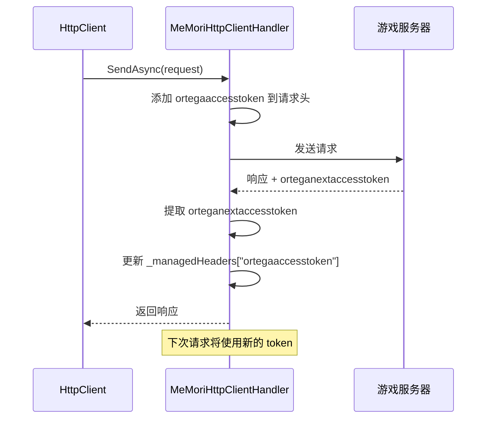
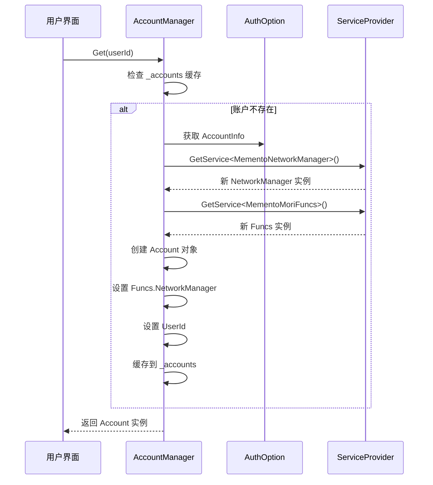
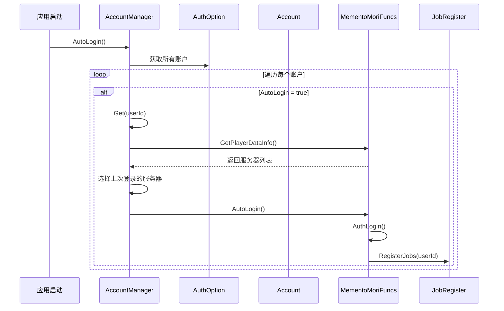
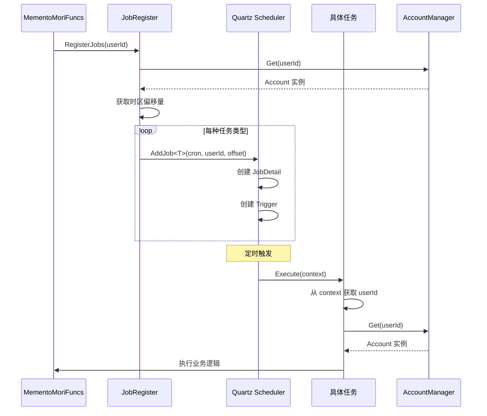
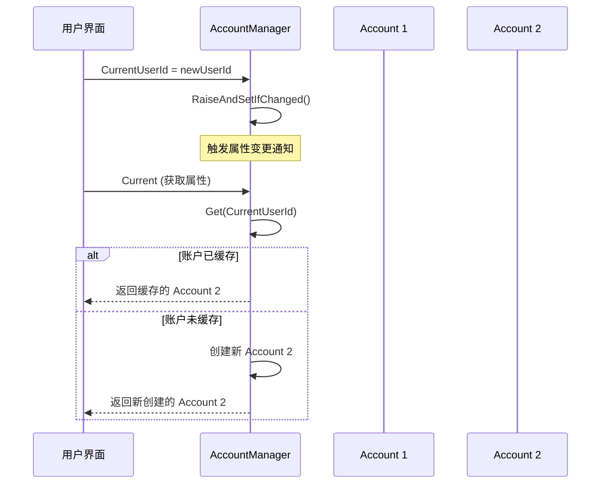
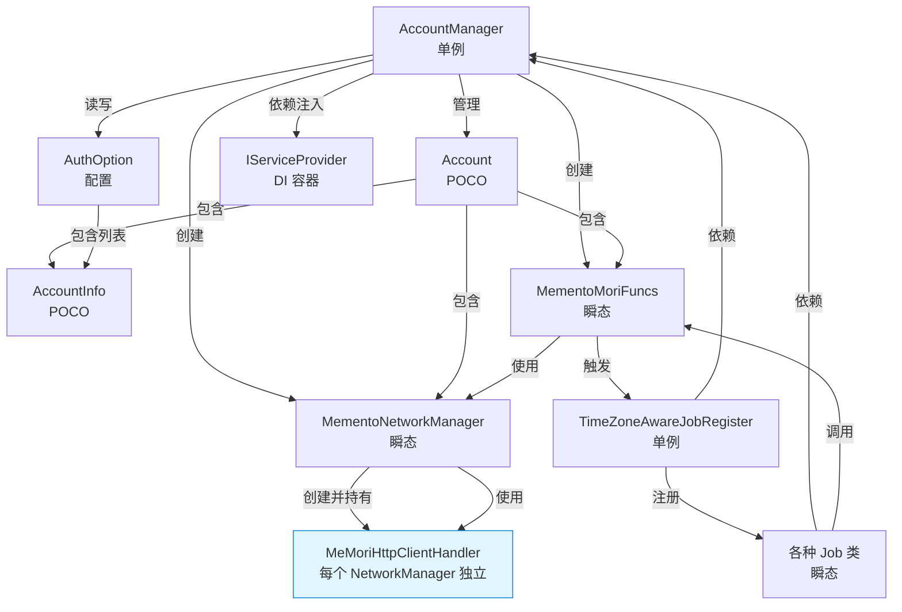

# 多账户管理架构文档

## 概述

本文档描述了 MementoMori Blazor 项目中多账户管理系统的代码结构和实现方式。该系统允许用户同时管理多个游戏账户，每个账户拥有独立的网络连接、功能实例和自动任务调度。

## 核心架构

### 1. 核心类

#### 1.1 AccountManager (账户管理器)

**文件路径**: [`blazor/MementoMori/AccountManager.cs`](file:///e:/Git_Github/MementoMori-react/blazor/MementoMori/AccountManager.cs)

**职责**: 
- 多账户生命周期管理
- 账户实例创建和缓存
- 当前账户切换
- 账户信息持久化

**核心属性**:

| 属性 | 类型 | 说明 |
|------|------|------|
| `_accounts` | `ConcurrentDictionary<long, Account>` | 账户实例缓存字典，以 UserId 为键 |
| `CurrentUserId` | `long` | 当前激活的用户 ID |
| `Current` | `Account` | 当前激活的账户实例 |
| `CurrentCulture` | `CultureInfo` | 当前语言文化设置 |

**核心方法**:

```csharp
// 获取或创建账户实例（线程安全）
[MethodImpl(MethodImplOptions.Synchronized)]
public Account Get(long userId)

// 添加新账户信息
public void AddAccountInfo(long userId, string clientKey, string name, bool autoLogin)

// 移除账户
public void RemoveAccount(long userId)

// 自动登录所有启用自动登录的账户
public async Task AutoLogin()

// 获取所有账户实例
public Dictionary<long, Account> GetAll()
```

**依赖注入**: 
- `IWritableOptions<AuthOption>` - 认证配置管理
- `IWritableOptions<GameConfig>` - 游戏配置管理
- `IServiceProvider` - 服务提供者，用于创建账户专属服务实例
- `ILogger<AccountManager>` - 日志记录器

**设计模式**:
- **单例模式**: 通过 `[RegisterSingleton<AccountManager>]` 注册为单例服务
- **延迟初始化**: 账户实例在首次访问时才创建
- **线程安全**: 使用 `ConcurrentDictionary` 和 `Synchronized` 方法确保线程安全

---

#### 1.2 Account (账户实例)

**文件路径**: [`blazor/MementoMori/AccountManager.cs#L154-L159`](file:///e:/Git_Github/MementoMori-react/blazor/MementoMori/AccountManager.cs#L154-L159)

**职责**: 封装单个账户的所有实例和状态

**属性**:

| 属性 | 类型 | 说明 |
|------|------|------|
| `AccountInfo` | `AccountInfo` | 账户基本信息（UserId、ClientKey、Name 等） |
| `NetworkManager` | `MementoNetworkManager` | 该账户专属的网络管理器实例 |
| `Funcs` | `MementoMoriFuncs` | 该账户专属的游戏功能实例 |

**设计要点**:
- 每个账户拥有独立的 `NetworkManager` 和 `Funcs` 实例
- 通过 `IServiceProvider.GetService<T>()` 创建瞬态（Transient）服务实例
- `Funcs` 和 `NetworkManager` 相互关联（`Funcs.NetworkManager = NetworkManager`）

---

#### 1.3 AccountInfo (账户信息)

**文件路径**: [`blazor/MementoMori/Option/AccountInfo.cs`](file:///e:/Git_Github/MementoMori-react/blazor/MementoMori/Option/AccountInfo.cs)

**职责**: 存储账户的持久化信息

**属性**:

```csharp
public class AccountInfo
{
    public string Name { get; set; }              // 账户显示名称
    public long UserId { get; set; }              // 用户 ID
    public string ClientKey { get; set; }         // 客户端密钥（用于认证）
    public bool AutoLogin { get; set; }           // 是否启用自动登录
    public long AutoLoginWorldId { get; set; }    // 自动登录的世界 ID
}
```

---

#### 1.4 AuthOption (认证配置)

**文件路径**: [`blazor/MementoMori/Option/AuthOption.cs`](file:///e:/Git_Github/MementoMori-react/blazor/MementoMori/Option/AuthOption.cs)

**职责**: 管理所有账户的认证配置

**核心属性**:

```csharp
public class AuthOption
{
    public List<AccountInfo> Accounts { get; set; } = new();  // 账户列表
    public long LastLoginUserId { get; set; }                 // 最后登录的用户 ID
    
    // 以下为已废弃的单账户字段
    [Obsolete] public string ClientKey { get; set; }
    [Obsolete] public long UserId { get; set; }
    
    // 设备信息
    public string AuthUrl { get; set; }
    public string DeviceToken { get; set; }
    public string AppVersion { get; set; }
    public string OSVersion { get; set; }
    public string ModelName { get; set; }
}
```

**数据迁移**: 
- `MigrateToAccountArray()` 方法负责将旧版本的单账户配置迁移到新的账户数组中

---

### 2. 账户专属服务实例

#### 2.1 MementoNetworkManager (网络管理器)

**文件路径**: [`blazor/MementoMori/MementoNetworkManager.cs`](file:///e:/Git_Github/MementoMori-react/blazor/MementoMori/MementoNetworkManager.cs)

**服务生命周期**: `[RegisterTransient<MementoNetworkManager>]` - 瞬态服务

**职责**:
- 管理与游戏服务器的网络通信
- 处理登录流程
- 发送和接收 API 请求
- 管理主数据（Master Data）下载和更新
- 语言和时区管理

**核心属性**:

| 属性 | 类型 | 说明 |
|------|------|------|
| `UserId` | `long` | 当前网络管理器关联的用户 ID |
| `LanguageType` | `LanguageType` | 当前语言类型 |
| `TimeManager` | `TimeManager` | 时间管理器（处理时区） |

**核心方法**:

```csharp
// 登录到指定世界
public async Task Login(long worldId, Action<string> addLog)

// 发送 API 请求并获取响应
public async Task<TResponse> GetResponse<TRequest, TResponse>(TRequest request)

// 设置语言文化
public void SetCultureInfo(CultureInfo cultureInfo)

// 下载主数据目录
public async Task DownloadMasterCatalog()
```

**设计要点**:
- 每个账户拥有独立的网络连接和会话状态
- 支持重试机制（`ExecWithRetry`）
- 通过 gRPC 与服务器通信

---

#### 2.2 MeMoriHttpClientHandler (HTTP 客户端处理器)

**文件路径**: [`blazor/MementoMori/MeMoriHttpClientHandler.cs`](file:///e:/Git_Github/MementoMori-react/blazor/MementoMori/MeMoriHttpClientHandler.cs)

**继承关系**: 继承自 `HttpClientHandler`

**职责**:
- 管理 HTTP 请求的自定义头部（Headers）
- 自动处理访问令牌（Access Token）的更新
- 处理主数据版本和资源版本的响应头
- 确保线程安全的请求发送

**核心属性**:

| 属性 | 类型 | 说明 |
|------|------|------|
| `OrtegaAccessToken` | `string` | 当前的访问令牌（从响应头自动更新） |
| `OrtegaMasterVersion` | `string` | 主数据版本号 |
| `OrtegaAssetVersion` | `string` | 资源版本号 |
| `AppVersion` | `string` | 应用版本号 |

**管理的请求头**:

```csharp
private readonly Dictionary<string, string> _managedHeaders = new()
{
    ["ortegaaccesstoken"] = "",           // 访问令牌（动态更新）
    ["ortegaappversion"] = "...",         // 应用版本
    ["ortegadevicetype"] = "2",           // 设备类型（2 = PC）
    ["ortegauuid"] = "...",               // 设备 UUID
    ["accept-encoding"] = "gzip",         // 接受 gzip 压缩
    ["user-agent"] = "BestHTTP/2 v2.3.0"  // 用户代理
};
```

**核心方法**:

```csharp
// 重写的请求发送方法
protected override async Task<HttpResponseMessage> SendAsync(
    HttpRequestMessage request, 
    CancellationToken cancellationToken)
```

**工作流程**:

1. **请求前处理**: 
   - 使用 `SemaphoreSlim` 确保线程安全（同一时间只有一个请求在处理）
   - 将所有 `_managedHeaders` 添加到请求头中

2. **发送请求**: 
   - 调用基类的 `SendAsync` 发送请求

3. **响应后处理**:
   - 从响应头中提取并更新 `orteganextaccesstoken`（下次请求的访问令牌）
   - 从响应头中提取并更新 `ortegamasterversion`（主数据版本）
   - 从响应头中提取并更新 `ortegaassetversion`（资源版本）

**线程安全机制**:

```csharp
private readonly SemaphoreSlim _semaphoreSlim = new(1, 1);

await _semaphoreSlim.WaitAsync(cancellationToken);
try
{
    // 处理请求和响应
}
finally
{
    _semaphoreSlim.Release();
}
```

**与 NetworkManager 的集成**:

每个 `MementoNetworkManager` 实例在构造后（`AutoPostConstruct`）会创建自己的 `MeMoriHttpClientHandler`：

```csharp
// 在 MementoNetworkManager.AutoPostConstruct() 中
MoriHttpClientHandler = new MeMoriHttpClientHandler 
{
    AppVersion = _authOption.Value.AppVersion
};
_httpClient = new HttpClient(MoriHttpClientHandler);
```

**访问令牌自动更新机制**:



**设计要点**:
- **每个账户独立**: 每个 `NetworkManager` 拥有独立的 `MeMoriHttpClientHandler` 实例
- **自动令牌管理**: 无需手动管理访问令牌，自动从响应中提取并应用到下次请求
- **线程安全**: 使用信号量确保同一账户的请求按顺序执行
- **版本跟踪**: 自动跟踪主数据和资源版本，便于判断是否需要更新

---

#### 2.3 MementoMoriFuncs (游戏功能集合)

**文件路径**: [`blazor/MementoMori/Funcs/Common.cs`](file:///e:/Git_Github/MementoMori-react/blazor/MementoMori/Funcs/Common.cs) 及其他 partial 类

**服务生命周期**: `[RegisterTransient<MementoMoriFuncs>]` - 瞬态服务

**职责**: 封装所有游戏功能的业务逻辑

**核心属性**:

| 属性 | 类型 | 说明 |
|------|------|------|
| `UserId` | `long` | 当前功能实例关联的用户 ID |
| `NetworkManager` | `MementoNetworkManager` | 关联的网络管理器 |
| `LoginOk` | `bool` | 是否已登录 |
| `Logining` | `bool` | 是否正在登录 |
| `IsQuickActionExecuting` | `bool` | 是否正在执行快速操作 |

**功能模块** (partial 类):

通过 partial class 将功能分散到多个文件中：

- **Auth.cs**: 认证和登录相关功能
  - `AutoLogin()` - 自动登录
  - `Login()` - 登录
  - `Logout()` - 登出
  - `GetClientKey()` - 获取客户端密钥
  
- **Battle.cs**: 战斗相关功能
- **BountyQuest.cs**: 赏金任务相关功能
- **Character.cs**: 角色管理相关功能
- **DungeonBattle.cs**: 地下城战斗相关功能
- **Equipment.cs**: 装备相关功能
- **Friend.cs**: 好友系统相关功能
- **Gacha.cs**: 抽卡相关功能
- **Guild.cs**: 公会相关功能
- **GuildRaid.cs**: 公会突袭相关功能
- **InfiniteTower.cs**: 无限塔相关功能
- **Item.cs**: 道具相关功能
- **LocalRaid.cs**: 本地突袭相关功能
- **LoginBonus.cs**: 登录奖励相关功能
- **Mission.cs**: 任务相关功能
- **Notice.cs**: 通知相关功能
- **Present.cs**: 礼物相关功能
- **Pvp.cs**: PvP 相关功能
- **Shop.cs**: 商店相关功能

**核心方法**:

```csharp
// 初始化功能实例
public async Task Initialize()

// 获取玩家数据信息列表
public async Task<List<PlayerDataInfo>> GetPlayerDataInfo()

// 同步用户数据
public async Task SyncUserData()

// 执行快速操作
public async Task ExecuteQuickAction(QuickActionItem item)

// 执行所有快速操作
public async Task ExecuteAllQuickAction()

// 添加日志
public void AddLog(string message)
```

**设计要点**:
- 通过 partial class 实现功能模块化
- 每个账户拥有独立的功能实例和状态
- 使用 ReactiveUI 实现属性变更通知

---

### 3. 自动任务调度系统

#### 3.1 TimeZoneAwareJobRegister (时区感知任务注册器)

**文件路径**: [`blazor/MementoMori/Jobs/TimeZoneAwareJobRegister.cs`](file:///e:/Git_Github/MementoMori-react/blazor/MementoMori/Jobs/TimeZoneAwareJobRegister.cs)

**服务生命周期**: `[RegisterSingleton<TimeZoneAwareJobRegister>]` - 单例服务

**职责**:
- 为每个账户注册独立的定时任务
- 根据账户所在服务器的时区调整任务执行时间
- 管理任务的注册和注销

**核心方法**:

```csharp
// 为指定账户注册所有任务
public async Task RegisterJobs(long userId)

// 注销指定账户的所有任务
public async Task DeregisterJobs(long userId)

// 为所有账户注册任务
public async Task RegisterAllJobs()

// 添加任务（内部方法）
private void AddJob<T>(IScheduler scheduler, string cron, string description, 
                       long userId, TimeSpan offset)

// 移除任务（内部方法）
private void RemoveJob<T>(IScheduler scheduler, long userId)
```

**支持的任务类型**:

| 任务类 | 说明 | 配置项 |
|--------|------|--------|
| `DailyJob` | 每日任务 | `DailyJobCron` |
| `HourlyJob` | 每小时奖励领取 | `HourlyJobCron` |
| `PvpJob` | PvP 自动战斗 | `PvpJobCron` |
| `LegendLeagueJob` | 传奇联赛 | `LegendLeagueJobCron` |
| `GuildRaidBossReleaseJob` | 公会突袭 Boss 释放 | `GuildRaidBossReleaseCron` |
| `AutoBuyShopItemJob` | 自动购买商店物品 | `AutoBuyShopItemJobCron` |
| `LocalRaidJob` | 本地突袭 | `AutoLocalRaidJobCron` |
| `AutoChangeGachaRelicJob` | 自动更换抽卡遗物 | `AutoChangeGachaRelicJobCron` |
| `AutoDrawGachaRelicJob` | 自动抽取遗物 | `AutoDrawGachaRelicJobCron` |

**设计要点**:
- 使用 Quartz.NET 进行任务调度
- 每个任务使用 `{userId}-{JobTypeName}` 作为唯一标识
- 通过自定义时区（`TimeZoneInfo.CreateCustomTimeZone`）实现服务器时区适配
- 任务参数通过 `JobDataMap` 传递 `userId`

---

#### 3.2 任务执行示例 - DailyJob

**文件路径**: [`blazor/MementoMori/Jobs/DailyJob.cs`](file:///e:/Git_Github/MementoMori-react/blazor/MementoMori/Jobs/DailyJob.cs)

```csharp
[AutoConstruct]
public partial class DailyJob: IJob
{
    private readonly AccountManager _accountManager;

    public async Task Execute(IJobExecutionContext context)
    {
        var userId = context.MergedJobDataMap.GetLongValue("userId");
        if (userId <= 0) return;
        
        var account = _accountManager.Get(userId);
        if (!account.Funcs.IsQuickActionExecuting) 
            await account.Funcs.Login();
        await account.Funcs.ExecuteAllQuickAction();
    }
}
```

**执行流程**:
1. 从任务上下文中获取 `userId`
2. 通过 `AccountManager.Get(userId)` 获取账户实例
3. 检查是否已登录，未登录则先登录
4. 执行所有快速操作

**设计优点**:
- 每个任务实例知道自己要操作哪个账户
- 任务执行互不干扰
- 支持多账户并行执行任务

---

## 4. 核心流程

### 4.1 账户创建流程



### 4.2 自动登录流程



### 4.3 任务调度流程



### 4.4 账户切换流程



---

## 5. 依赖关系图



---

## 6. 关键设计模式和原则

### 6.1 单例 vs 瞬态服务

| 服务类型 | 生命周期 | 原因 |
|----------|----------|------|
| `AccountManager` | 单例 | 全局唯一的账户管理器，负责缓存和协调 |
| `TimeZoneAwareJobRegister` | 单例 | 全局任务调度器，管理所有账户的任务 |
| `MementoNetworkManager` | 瞬态 | 每个账户需要独立的网络连接和会话 |
| `MeMoriHttpClientHandler` | 非 DI 管理 | 每个 NetworkManager 手动创建，确保独立的 HTTP 上下文 |
| `MementoMoriFuncs` | 瞬态 | 每个账户需要独立的业务逻辑和状态 |
| 各种 Job 类 | 瞬态 | 每次任务执行创建新实例 |

### 6.2 线程安全

- **ConcurrentDictionary**: 用于账户实例缓存，支持多线程并发访问
- **Synchronized**: `Get()` 方法使用同步锁，防止重复创建账户实例
- **ReactiveUI**: 属性变更通知机制，支持跨线程更新

### 6.3 依赖注入

- 通过 `[RegisterSingleton]` 和 `[RegisterTransient]` 属性标记服务生命周期
- 使用 `[AutoConstruct]` 自动生成构造函数
- 通过 `IServiceProvider.GetService<T>()` 动态创建账户专属服务

### 6.4 配置管理

- 使用 `IWritableOptions<T>` 支持配置的读写
- `AuthOption` 存储账户信息
- `GameConfig` 存储游戏配置（包括任务 Cron 表达式）

---

## 7. 扩展点

### 7.1 添加新账户

```csharp
accountManager.AddAccountInfo(
    userId: 123456,
    clientKey: "your-client-key",
    name: "新账户",
    autoLogin: true
);
```

### 7.2 添加新的自动任务

1. 创建任务类，实现 `IJob` 接口
2. 在 `TimeZoneAwareJobRegister.RegisterJobs()` 中添加 `AddJob` 调用
3. 在 `TimeZoneAwareJobRegister.DeregisterJobs()` 中添加 `RemoveJob` 调用
4. 在 `GameConfig.AutoJob` 中添加对应的 Cron 配置项

### 7.3 添加新的游戏功能

1. 在 `Funcs/` 目录下创建新的 partial class 文件
2. 声明为 `public partial class MementoMoriFuncs`
3. 实现具体功能方法
4. 可以直接访问 `NetworkManager`、`UserId` 等共享属性

---

## 8. 最佳实践

### 8.1 获取账户实例

```csharp
// 推荐：通过 AccountManager 获取
var account = accountManager.Get(userId);
await account.Funcs.SomeMethod();

// 或者使用当前账户
var currentAccount = accountManager.Current;
```

### 8.2 执行账户操作

```csharp
// 在 Job 中
public async Task Execute(IJobExecutionContext context)
{
    var userId = context.MergedJobDataMap.GetLongValue("userId");
    var account = _accountManager.Get(userId);
    
    // 执行操作
    await account.Funcs.DoSomething();
}
```

### 8.3 切换当前账户

```csharp
// 简单切换
accountManager.CurrentUserId = newUserId;

// 获取当前账户会自动返回新账户的实例
var current = accountManager.Current;
```

---

## 9. 注意事项

1. **不要手动创建 Account 实例**，始终通过 `AccountManager.Get()` 获取
2. **账户实例会被缓存**，相同 userId 多次调用 `Get()` 会返回同一实例
3. **任务执行是并行的**，多个账户的任务可能同时执行
4. **配置更改**需要通过 `IWritableOptions.Update()` 方法持久化
5. **语言切换**会影响所有已创建的账户的 NetworkManager
6. **时区偏移**从 `NetworkManager.TimeManager.DiffFromUtc` 获取，每个服务器可能不同

---

## 10. 总结

MementoMori 的多账户管理系统通过以下设计实现了灵活的多账户支持：

- **中心化管理**: `AccountManager` 作为单例管理所有账户
- **实例隔离**: 每个账户拥有独立的 `NetworkManager` 和 `Funcs` 实例
- **自动化任务**: 通过 Quartz.NET 为每个账户调度独立的定时任务
- **配置持久化**: 账户信息存储在 `AuthOption` 中，支持自动登录
- **依赖注入**: 充分利用 DI 容器管理服务生命周期
- **模块化设计**: 通过 partial class 将功能分散到多个文件

这种架构使得系统能够轻松支持多账户并行操作，同时保持代码的清晰和可维护性。
