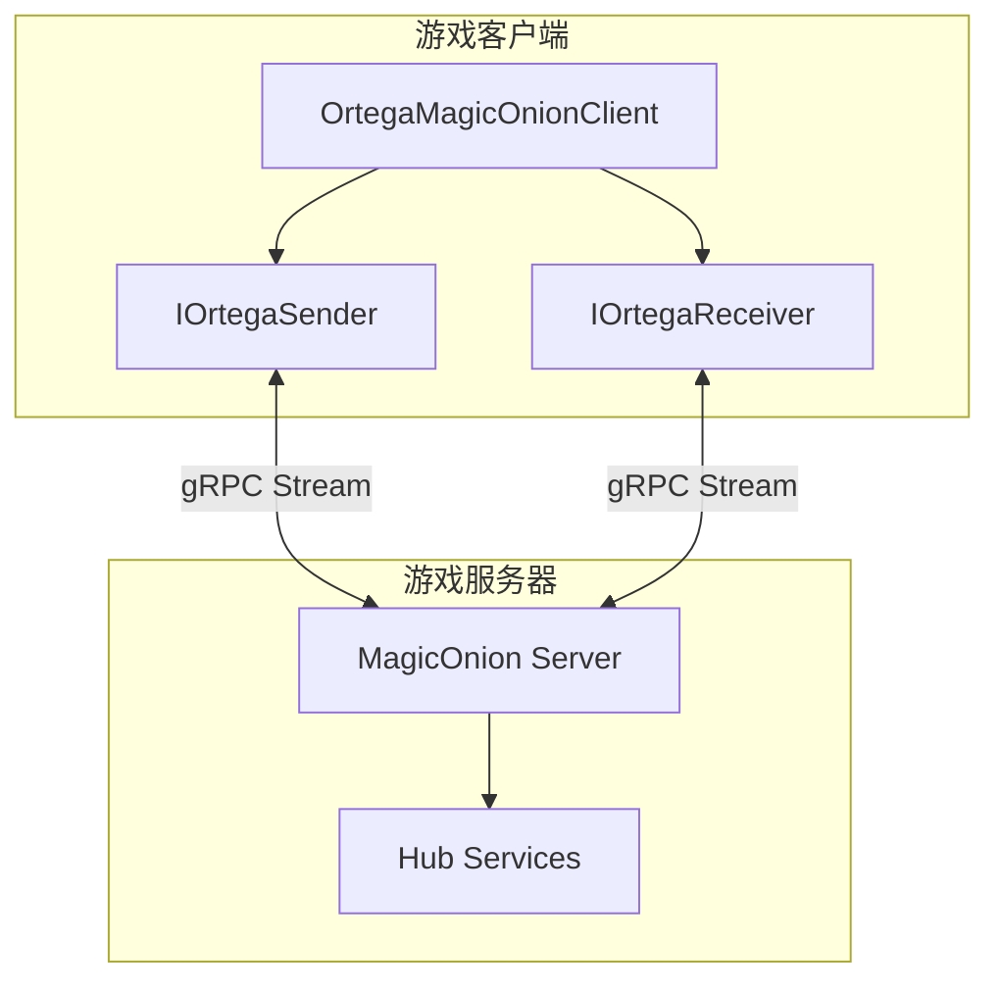
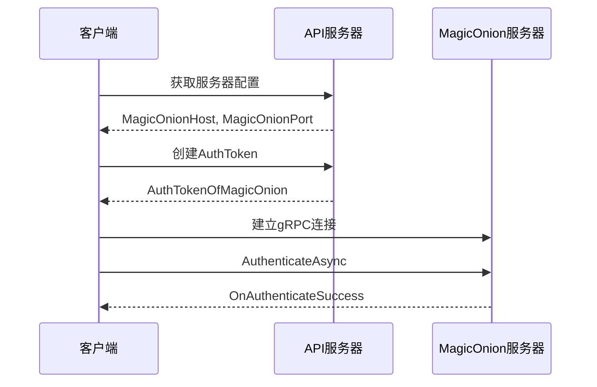
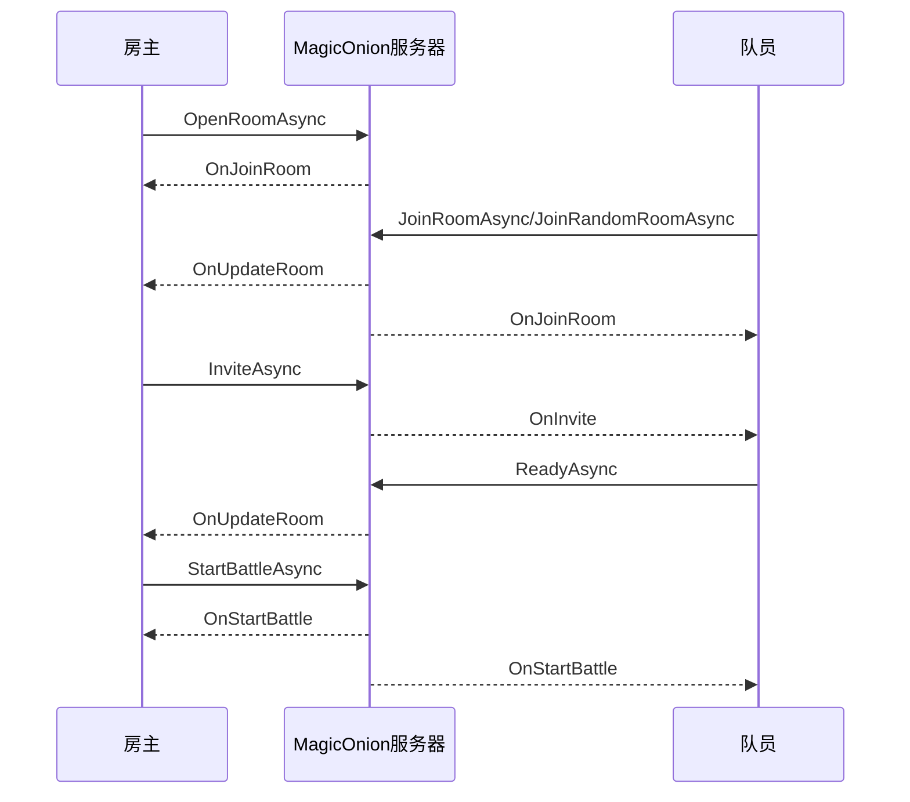

# MagicOnion 实时通信系统文档

## 概述

MagicOnion 是 MementoMori 游戏中使用的实时通信框架，基于 gRPC 和 MessagePack 构建。它提供了双向流式通信能力，用于实现游戏中的实时多人功能。

### 技术栈

- **MagicOnion**: .NET RPC 框架，统一了 gRPC 和 MessagePack
- **gRPC**: 高性能 RPC 框架
- **MessagePack**: 高效的二进制序列化格式

## 架构设计

### 整体架构



### 目录结构

```
D:/mementomori/sln/Ortega/
├── Network/MagicOnion/
│   ├── Client/
│   │   ├── BaseMagicOnionClient.cs      # 基础客户端抽象类
│   │   ├── MagicOnionClient.cs          # 泛型客户端基类
│   │   ├── OrtegaMagicOnionClient.cs    # 具体实现类
│   │   └── OrtegaMagicOnionClientLogger.cs  # 日志记录器
│   ├── Interface/
│   │   ├── IDisconnectReceiver.cs       # 断开连接接收器
│   │   ├── IMagicOnionAuthenticateReceiver.cs  # 认证接收器
│   │   ├── IMagicOnionChatReceiver.cs   # 聊天接收器
│   │   ├── IMagicOnionErrorReceiver.cs  # 错误接收器
│   │   ├── IMagicOnionGuildTowerReceiver.cs  # 公会塔接收器
│   │   ├── IMagicOnionGvgReceiver.cs    # 公会战接收器
│   │   ├── IMagicOnionLocalRaidNotificaiton.cs  # 本地突袭通知
│   │   └── IMagicOnionLocalRaidReceiver.cs  # 本地突袭接收器
│   └── Listener/
│       └── MagicOnionLocalRaidListener.cs  # 本地突袭监听器
│
└── Share/MagicOnionShare/
    ├── Interfaces/
    │   ├── Sender/
    │   │   ├── IOrtegaSender.cs         # 发送者接口定义
    │   │   └── OrtegaSenderClient.cs    # 生成的客户端代码
    │   └── Receiver/
    │       └── IOrtegaReceiver.cs       # 接收者接口定义
    ├── Request/                          # 请求类型定义
    └── Response/                         # 响应类型定义
```

## 核心组件

### 1. BaseMagicOnionClient

基础客户端抽象类，提供连接状态管理和基本操作。

```csharp
public abstract class BaseMagicOnionClient
{
    // 构造函数
    public BaseMagicOnionClient(long playerId, string authToken);
    
    // 抽象方法
    public abstract Task DisposeAsync();
    public abstract bool IsExistHubClient();
    protected abstract void ConnectHub();
    protected abstract void Authenticate();
    protected abstract void ReAuthenticating();
    protected abstract void SucceededAuthentication();
    protected abstract void FailedAuthentication();
    protected abstract void WatchDisconnect();
    
    // 状态管理
    public HubClientState GetState();
    public bool IsNeedToReconnect();
    public bool IsReady();
    public void Connect();
    public void TryReconnect();
    public void RefreshAuthToken(string authToken);
    
    // 重试机制
    public int GetRetryCount();
    public void ResetRetryCount();
    
    // 受保护字段
    protected long _playerId;
    protected string _authToken;
    protected HubClientState _state;
    private int _retryCount;
}
```

### 2. MagicOnionClient<TSender, TReceiver>

泛型客户端基类，实现 StreamingHub 的通用逻辑。

```csharp
public abstract class MagicOnionClient<TSender, TReceiver> : BaseMagicOnionClient 
    where TSender : IStreamingHub<TSender, TReceiver>
{
    public MagicOnionClient(GrpcChannelx channel, long playerId, string authToken);
    
    public override bool IsExistHubClient();
    public override Task DisposeAsync();
    
    protected void AttachInternalReceiver(TReceiver internalReceiver, IDisconnectReceiver internalDisconnectReceiver);
    protected void AttachLogger(IMagicOnionClientLogger logger);
    
    // 状态转换方法
    protected override void ConnectHub();
    protected override void Authenticate();
    protected override void ReAuthenticating();
    protected override void SucceededAuthentication();
    protected override void FailedAuthentication();
    protected override void WatchDisconnect();
    
    // 受保护字段
    protected GrpcChannelx _channel;
    protected TSender _sender;
    protected TReceiver _internalReceiver;
    protected IDisconnectReceiver _internalDisconnectReceiver;
    protected IMagicOnionClientLogger _logger;
}
```

### 3. OrtegaMagicOnionClient

游戏的具体 MagicOnion 客户端实现，处理所有实时通信功能。

```csharp
public class OrtegaMagicOnionClient : MagicOnionClient<IOrtegaSender, IOrtegaReceiver>, 
    IOrtegaReceiver, IDisconnectReceiver
{
    // 构造函数
    public OrtegaMagicOnionClient(GrpcChannelx channel, long playerId, string authToken, 
        IMagicOnionLocalRaidNotificaiton localRaidNotification, OrtegaMagicOnionClientLogger logger);
    
    // 设置各功能模块的接收器
    public void SetupLocalRaid(IMagicOnionLocalRaidReceiver localRaidReceiver, IMagicOnionErrorReceiver errorReceiver);
    public void SetupChat(IMagicOnionChatReceiver receiver, IMagicOnionAuthenticateReceiver authenticateReceiver, IMagicOnionErrorReceiver errorReceiver);
    public void SetupGvg(IMagicOnionGvgReceiver receiver, IMagicOnionErrorReceiver errorReceiver, BattleType battleType);
    public void SetupGuildTower(IMagicOnionGuildTowerReceiver receiver);
    public void SetupAchieveReward(IMagicOnionAchieveRewardReceiver receiver);
    
    // 清理接收器
    public void ClearGvgReceiver();
    public void ClearLocalRaidReceiver();
    public void ClearGuildTowerReceiver(IMagicOnionGuildTowerReceiver receiver);
    public void ClearAchieveRewardReceiver();
    public void ClearErrorReceiver();
    public void ClearLocalRaidPartyInfo();
    
    // 私有接收器字段
    private IMagicOnionChatReceiver _chatReceiver;
    private IMagicOnionGvgReceiver _gvgLocalReceiver;
    private IMagicOnionGvgReceiver _gvgGlobalReceiver;
    private IMagicOnionAuthenticateReceiver _authenticateReceiver;
    private IMagicOnionErrorReceiver _errorReceiver;
    private IMagicOnionLocalRaidNotificaiton _localRaidNotification;
    private IMagicOnionLocalRaidReceiver _localRaidReceiver;
    private IMagicOnionGuildTowerReceiver _guildTowerReceiver;
    private IMagicOnionAchieveRewardReceiver _achieveRewardReceiver;
}
```

## 接口定义

### IOrtegaSender - 发送者接口

客户端向服务器发送请求的接口：

```csharp
public interface IOrtegaSender : IStreamingHub<IOrtegaSender, IOrtegaReceiver>
{
    // 认证
    Task AuthenticateAsync(AuthenticateRequest request);
    
    // 心跳
    Task KeepAliveAsync();
    
    // ============ LocalRaid 本地突袭 ============
    Task DisbandRoomAsync();                    // 解散房间
    Task GetRoomListAsync(GetRoomListRequest request);  // 获取房间列表
    Task InviteAsync(InviteRequest request);    // 邀请玩家
    Task InviteRefuseAsync(InviteRefuseRequest request);  // 拒绝邀请
    Task JoinFriendRoomAsync(JoinFriendRoomRequest request);  // 加入好友房间
    Task JoinRandomRoomAsync(JoinRandomRoomRequest request);  // 随机加入房间
    Task JoinRoomAsync(JoinRoomRequest request);  // 加入指定房间
    Task LeaveRoomAsync();                      // 离开房间
    Task OpenRoomAsync(OpenRoomRequest request);  // 创建房间
    Task RefuseAsync(RefuseRequest request);    // 拒绝
    Task ReadyAsync(ReadyRequest request);      // 准备
    Task UpdateBattlePowerAsync(UpdateBattlePowerRequest request);  // 更新战斗力
    Task UpdateRoomConditionAsync(UpdateRoomConditionRequest request);  // 更新房间条件
    Task StartBattleAsync();                    // 开始战斗
    Task UpdatePartyCountAsync();               // 更新队伍数量
    Task RoomClearAsync();                      // 清理房间
    
    // ============ 聊天功能 ============
    Task SendMessageAsync(SendMessageRequest request);  // 发送消息
    
    // ============ LocalGvg 本地公会战 ============
    Task LocalGvgAddCastleParty(AddCastlePartyRequest request);     // 添加城池队伍
    Task LocalGvgOrderCastleParty(OrderCastlePartyRequest request); // 排序城池队伍
    Task LocalGvgOpenBattleDialog(OpenBattleDialogRequest request); // 打开战斗对话框
    Task LocalGvgOpenPartyDeployDialog(OpenPartyDeployDialogRequest request);  // 打开队伍部署对话框
    Task LocalGvgCloseCastleDialog(CloseDialogRequest request);     // 关闭城池对话框
    Task LocalGvgCastleDeclaration(CastleDeclarationRequest request);  // 城池宣战
    Task LocalGvgCastleDeclarationCounter(CastleDeclarationCounterRequest request);  // 反击宣战
    Task LocalGvgOpenMap();                     // 打开地图
    Task LocalGvgCloseMap();                    // 关闭地图
    Task LocalGvgSetCastleMemo(SetCastleMemoRequest request);   // 设置城池备注
    Task LocalGvgResetCastleMemo(ResetCastleMemoRequest request);  // 重置城池备注
    
    // ============ GlobalGvg 全球公会战 ============
    Task GlobalGvgAddCastleParty(AddCastlePartyRequest request);
    Task GlobalGvgOrderCastleParty(OrderCastlePartyRequest request);
    Task GlobalGvgOpenBattleDialog(OpenBattleDialogRequest request);
    Task GlobalGvgOpenPartyDeployDialog(OpenPartyDeployDialogRequest request);
    Task GlobalGvgCloseCastleDialog(CloseDialogRequest request);
    Task GlobalGvgCastleDeclaration(CastleDeclarationRequest request);
    Task GlobalGvgCastleDeclarationCounter(CastleDeclarationCounterRequest request);
    Task GlobalGvgOpenMap(OpenMapRequest request);
    Task GlobalGvgCloseMap();
    Task GlobalGvgSetCastleMemo(SetCastleMemoRequest request);
    Task GlobalGvgResetCastleMemo(ResetCastleMemoRequest request);
}
```

### IOrtegaReceiver - 接收者接口

服务器向客户端推送消息的接口：

```csharp
public interface IOrtegaReceiver
{
    // 认证
    void OnAuthenticateSuccess();
    
    // 错误处理
    void OnError(ErrorCode errorCode);
    
    // ============ LocalRaid 本地突袭 ============
    void OnDisbandRoom();                       // 房间解散
    void OnGetRoomList(OnGetRoomListResponse response);  // 获取房间列表
    void OnJoinRoom(OnJoinRoomResponse response);  // 加入房间
    void OnInvite(OnInviteResponse response);    // 被邀请
    void OnInviteRefuse(OnInviteRefuseResponse response);  // 邀请被拒绝
    void OnLeaveRoom();                         // 离开房间
    void OnLockRoom();                          // 房间锁定
    void OnRefuse();                            // 被拒绝
    void OnStartBattle();                       // 开始战斗
    void OnUpdatePartyCount(OnUpdatePartyCountResponse response);  // 更新队伍数量
    void OnUpdateRoom(OnUpdateRoomResponse response);  // 更新房间
    
    // ============ 聊天功能 ============
    void OnNoticePrivateMessage(OnNoticePrivateMessageResponse response);  // 私聊通知
    void OnRemovedFromGuild();                  // 被移出公会
    void OnReceiveGuildChatLog(OnReceiveGuildChatLogResponse response);  // 接收公会聊天记录
    void OnReceiveSvSChatLog(OnReceiveSvSChatLogResponse response);  // 接收SvS聊天记录
    void OnReceiveWorldChatLog(OnReceiveWorldChatLogResponse response);  // 接收世界聊天记录
    void OnReceiveBlockChatLog(OnReceiveBlockChatLogResponse response);  // 接收屏蔽聊天记录
    void OnReceiveMessage(OnReceiveMessageResponse response);  // 接收消息
    void OnReactChat(OnReactChatResponse response);  // 聊天反应
    void OnChangeChatOption(OnChangeChatOptionResponse response);  // 聊天选项变更
    
    // ============ LocalGvg 本地公会战 ============
    void OnLocalGvgOpenBattleDialog(OnOpenBattleDialogResponse response);
    void OnLocalGvgUpdateCastleParty(OnUpdateCastlePartyResponse response);
    void OnLocalGvgEndCastleBattle(OnEndCastleBattleResponse response);
    void OnLocalGvgUpdateMap(OnUpdateMapResponse response);
    void OnLocalGvgUpdateDeployCharacter(OnUpdateDeployCharacterResponse response);
    void OnLocalGvgAddOnlyReceiverParty(OnAddOnlyReceiverPartyResponse response);
    void OnLocalGvgUpdateCastleMemo(OnUpdateCastleMemoResponse response);
    
    // ============ GlobalGvg 全球公会战 ============
    void OnGlobalGvgOpenBattleDialog(OnOpenBattleDialogResponse response);
    void OnGlobalGvgUpdateCastleParty(OnUpdateCastlePartyResponse response);
    void OnGlobalGvgEndCastleBattle(OnEndCastleBattleResponse response);
    void OnGlobalGvgUpdateMap(OnUpdateMapResponse response);
    void OnGlobalGvgUpdateDeployCharacter(OnUpdateDeployCharacterResponse response);
    void OnGlobalGvgAddOnlyReceiverParty(OnAddOnlyReceiverPartyResponse response);
    void OnGlobalGvgUpdateCastleMemo(OnUpdateCastleMemoResponse response);
    
    // ============ 其他功能 ============
    void OnNoticeGuildTowerInfo(GuildTowerInfoResponse response);  // 公会塔信息
    void OnReceiveAchieveReward(OnReceiveAchieveRewardResponse response);  // 成就奖励
}
```

## 功能模块

### 1. LocalRaid 本地突袭

本地突袭是多人组队战斗功能，玩家可以创建或加入房间进行协作战斗。

#### 连接流程



#### 房间操作流程



#### 请求类型

| 请求类型 | 说明 |
|---------|------|
| `OpenRoomRequest` | 创建房间，包含条件类型、密码、任务ID、战斗力要求、是否自动开始 |
| `JoinRoomRequest` | 加入指定房间，包含房间ID和密码 |
| `JoinFriendRoomRequest` | 加入好友房间 |
| `JoinRandomRoomRequest` | 随机加入房间 |
| `InviteRequest` | 邀请玩家 |
| `InviteRefuseRequest` | 拒绝邀请 |
| `ReadyRequest` | 准备战斗 |
| `UpdateBattlePowerRequest` | 更新战斗力 |
| `UpdateRoomConditionRequest` | 更新房间条件 |

#### 响应类型

| 响应类型 | 说明 |
|---------|------|
| `OnGetRoomListResponse` | 房间列表，包含 `LocalRaidPartyInfo` 列表 |
| `OnJoinRoomResponse` | 加入房间结果，包含 `LocalRaidPartyInfo` |
| `OnInviteResponse` | 邀请信息，包含玩家信息、房间信息 |
| `OnUpdateRoomResponse` | 房间更新信息 |
| `OnUpdatePartyCountResponse` | 队伍数量更新 |

### 2. GvG 公会战

公会战分为 LocalGvg（本地公会战）和 GlobalGvg（全球公会战）两种模式。

#### 功能模块

- **城池管理**: 打开/关闭地图、查看城池信息
- **队伍部署**: 添加队伍、排序队伍、部署角色
- **战斗系统**: 宣战、反击、战斗结果
- **备注系统**: 设置/重置城池备注

#### 请求类型

| 请求类型 | 说明 |
|---------|------|
| `AddCastlePartyRequest` | 添加城池队伍 |
| `OrderCastlePartyRequest` | 排序城池队伍 |
| `OpenBattleDialogRequest` | 打开战斗对话框 |
| `OpenPartyDeployDialogRequest` | 打开队伍部署对话框 |
| `CloseDialogRequest` | 关闭对话框 |
| `CastleDeclarationRequest` | 城池宣战 |
| `CastleDeclarationCounterRequest` | 反击宣战 |
| `OpenMapRequest` | 打开地图 |
| `SetCastleMemoRequest` | 设置城池备注 |
| `ResetCastleMemoRequest` | 重置城池备注 |

#### 响应类型

| 响应类型 | 说明 |
|---------|------|
| `OnOpenBattleDialogResponse` | 战斗对话框数据，包含攻防双方队伍信息 |
| `OnUpdateCastlePartyResponse` | 城池队伍更新 |
| `OnEndCastleBattleResponse` | 城池战斗结束 |
| `OnUpdateMapResponse` | 地图更新，包含城池信息和活跃玩家 |
| `OnUpdateDeployCharacterResponse` | 部署角色更新 |
| `OnAddOnlyReceiverPartyResponse` | 添加防守方队伍 |
| `OnUpdateCastleMemoResponse` | 城池备注更新 |

### 3. Chat 聊天系统

实时聊天功能，支持多种聊天频道。

#### 聊天频道

- **公会聊天** (GuildChat)
- **世界聊天** (WorldChat)
- **SvS聊天** (SvSChat)
- **私聊** (PrivateMessage)

#### 请求类型

| 请求类型 | 说明 |
|---------|------|
| `SendMessageRequest` | 发送消息 |

#### 响应类型

| 响应类型 | 说明 |
|---------|------|
| `OnReceiveMessageResponse` | 接收消息 |
| `OnReceiveGuildChatLogResponse` | 公会聊天记录 |
| `OnReceiveWorldChatLogResponse` | 世界聊天记录 |
| `OnReceiveSvSChatLogResponse` | SvS聊天记录 |
| `OnReceiveBlockChatLogResponse` | 屏蔽聊天记录 |
| `OnNoticePrivateMessageResponse` | 私聊通知 |
| `OnReactChatResponse` | 聊天反应 |
| `OnChangeChatOptionResponse` | 聊天选项变更 |

## 连接管理

### 服务器配置获取

通过 API 获取 MagicOnion 服务器地址：

```csharp
// API 响应中包含 MagicOnion 配置
public class GetServerHostResponse
{
    public string MagicOnionHost { get; set; }
    public int MagicOnionPort { get; set; }
    // ... 其他字段
}
```

### 认证令牌

通过 API 创建 MagicOnion 认证令牌：

```csharp
// 请求
[OrtegaApi("user/createAuthTokenOfMagicOnion", true, false)]
public class CreateAuthTokenOfMagicOnionRequest : ApiRequestBase { }

// 响应
public class CreateAuthTokenOfMagicOnionResponse : ApiResponseBase
{
    public string AuthTokenOfMagicOnion { get; set; }
}
```

### 连接状态

```csharp
public enum HubClientState
{
    Idle = 0,               // 空闲
    Ready = 1,              // 准备就绪
    Authenticating = 2,     // 认证中
    ReAuthenticating = 3,   // 重新认证中
    Authenticated = 4,      // 已认证
    FailedAuthentication = 5, // 认证失败
    Disconnected = 6        // 已断开
}
```

### 重连机制

客户端实现了自动重连机制：

```csharp
// 检查是否需要重连
public bool IsNeedToReconnect()
{
    HubClientState state = this._state;
    return state == HubClientState.FailedAuthentication || 
           state == HubClientState.Disconnected;
}

// 尝试重连
public void TryReconnect()
{
    if (IsNeedToReconnect() && this._state != HubClientState.Ready)
    {
        if (this._state == HubClientState.FailedAuthentication)
        {
            this.ReAuthenticating();  // 重新认证
        }
        else
        {
            this.ConnectHub();  // 重新连接
        }
    }
}
```

## 错误处理

### 错误码定义

MagicOnion 相关的错误码范围：`900102` - `1002000`

#### LocalRaid 错误码

| 错误码 | 名称 | 说明 |
|--------|------|------|
| 900102 | MagicOnionLocalRaidDisbandRoomFailed | 解散房间失败 |
| 900103 | MagicOnionLocalRaidJoinRoomAlreadyJoinedOtherRoom | 已加入其他房间 |
| 900104 | MagicOnionLocalRaidJoinRoomNoRemainingChallenges | 挑战次数不足 |
| 900105 | MagicOnionLocalRaidJoinRoomNotExistRoom | 房间不存在 |
| 900106 | MagicOnionLocalRaidJoinRoomMembersAreFull | 房间已满 |
| 900107 | MagicOnionLocalRaidJoinRoomNotEnoughBattlePower | 战斗力不足 |
| 900108 | MagicOnionLocalRaidJoinRoomWrongPassword | 密码错误 |
| 900109 | MagicOnionLocalRaidJoinRoomRedisError | Redis错误 |
| 900110 | MagicOnionLocalRaidLeaveRoomFailed | 离开房间失败 |
| 900111 | MagicOnionLocalRaidLeaveRoomNotExistRoom | 房间不存在 |
| 900112 | MagicOnionLocalRaidLeaveRoomIsLeader | 房主不能离开 |
| 900113 | MagicOnionLocalRaidLeaveRoomNotFoundData | 数据未找到 |
| 900114 | MagicOnionLocalRaidLeaveRoomRedisError | Redis错误 |
| 900115 | MagicOnionLocalRaidOpenRoomAlreadyJoinedOtherRoom | 已加入其他房间 |
| 900116 | MagicOnionLocalRaidOpenRoomQuestNotHeld | 任务未开放 |
| 900117 | MagicOnionLocalRaidOpenRoomNoRemainingChallenges | 挑战次数不足 |
| 900118 | MagicOnionLocalRaidStartBattleFailed | 开始战斗失败 |
| 900119 | MagicOnionLocalRaidStartBattleNotFoundData | 数据未找到 |
| 900120 | MagicOnionLocalRaidStartBattleExpiredLocalRaidQuest | 任务已过期 |
| 900121 | MagicOnionLocalRaidRefuse | 驱逐失败 |
| 900122 | MagicOnionLocalRaidRefuseNotFoundData | 数据未找到 |
| 900123 | MagicOnionLocalRaidRefuseRedisError | Redis错误 |
| 900124 | MagicOnionLocalRaidRefuseNotExistRoom | 房间不存在 |
| 900125 | MagicOnionLocalRaidInviteNotFriend | 不是好友 |
| 900126 | MagicOnionLocalRaidInviteNotFoundData | 数据未找到 |
| 900127 | MagicOnionLocalRaidJoinFriendRoomNotFoundData | 数据未找到 |
| 900128 | MagicOnionLocalRaidJoinFriendRoomAlreadyJoinedOtherRoom | 已加入其他房间 |
| 900129 | MagicOnionLocalRaidJoinFriendRoomNoRemainingChallenges | 挑战次数不足 |
| 900130 | MagicOnionLocalRaidJoinFriendRoomMembersAreFull | 房间已满 |
| 900131 | MagicOnionLocalRaidJoinFriendRoomRedisError | Redis错误 |
| 900132 | MagicOnionLocalRaidJoinFriendRoomNotExistRoom | 房间不存在 |
| 900133 | MagicOnionLocalRaidJoinRandomRoomAlreadyJoinedOtherRoom | 已加入其他房间 |
| 900134 | MagicOnionLocalRaidJoinRandomRoomNoRemainingChallenges | 挑战次数不足 |
| 900135 | MagicOnionLocalRaidJoinRandomRoomNotExistRoom | 房间不存在 |
| 900136 | MagicOnionLocalRaidJoinRandomRoomRedisError | Redis错误 |
| 900137 | MagicOnionLocalRaidExpiredLocalRaidQuest | 任务已过期 |
| 900138 | MagicOnionLocalRaidInviteNoRemainingChallenges | 挑战次数不足 |
| 900139 | MagicOnionLocalRaidNotOpenQuest | 没有开放的任务 |
| 900140 | MagicOnionLocalRaidReadyIsLeader | 房主不能准备 |
| 900141 | MagicOnionLocalRaidAllNotReady | 有人未准备 |
| 900142 | MagicOnionLocalRaidReadyFailed | 准备失败 |
| 900143 | MagicOnionLocalRaidReadyNotExistRoom | 房间不存在 |
| 900144 | MagicOnionLocalRaidReadyNotFoundData | 数据未找到 |
| 900145 | MagicOnionLocalRaidReadyRedisError | Redis错误 |
| 900146 | MagicOnionLocalRaidUpdateRoomConditionFailed | 更新条件失败 |
| 900147 | MagicOnionLocalRaidUpdateRoomConditionIsNotLeader | 不是房主 |
| 900148 | MagicOnionLocalRaidUpdateRoomConditionRedisError | Redis错误 |
| 900150 | MagicOnionLocalRaidUpdateBattlePowerFailed | 更新战斗力失败 |
| 900151 | MagicOnionLocalRaidUpdateBattlePowerNotExistRoom | 房间不存在 |
| 900152 | MagicOnionLocalRaidUpdateBattlePowerNotFoundData | 数据未找到 |
| 900153 | MagicOnionLocalRaidUpdateBattlePowerRedisError | Redis错误 |
| 900154 | MagicOnionLocalRaidStartBattleNotEnoughBattlePower | 战斗力不足 |
| 900155 | MagicOnionLocalRaidJoinRoomNotSameWorld | 不同世界 |
| 900156 | MagicOnionLocalRaidNotEnoughBattleData | 战斗数据不足 |

#### GlobalGvg 错误码

| 错误码 | 名称 | 说明 |
|--------|------|------|
| 900302 | MagicOnionGlobalGvgAddCastlePartyInvalidRequest | 无效请求 |
| 900303 | MagicOnionGlobalGvgAddCastlePartyInvalidData | 数据无效 |
| 900304 | MagicOnionGlobalGvgAddCastlePartyNotOwnCastle | 非己方城池 |
| 900305 | MagicOnionGlobalGvgAddCastlePartyNotEnoughActionPoint | 行动力不足 |
| 900306 | MagicOnionGlobalGvgAddCastlePartySameCharacter | 重复角色 |
| 900307 | MagicOnionGlobalGvgOrderCastlePartyFirst | 不能操作第一个队伍 |
| 900308 | MagicOnionGlobalGvgOrderCastlePartyInvalidData | 数据无效 |
| 900309 | MagicOnionGlobalGvgCastleDeclarationInvalidData | 数据无效 |
| 900310 | MagicOnionGlobalGvgCastleDeclarationDistant | 城池不相邻 |
| 900311 | MagicOnionGlobalGvgCastleDeclarationByOtherGuild | 已被其他公会宣战 |
| 900312 | MagicOnionGlobalGvgCastleDeclarationMaxCount | 达到宣战上限 |
| 900313 | MagicOnionGlobalGvgCastleDeclarationCounterInvalidData | 数据无效 |
| 900314 | MagicOnionGlobalGvgCheckCanJoinBattleAndNoticeNotJoinGuild | 未加入公会 |
| 900315 | MagicOnionGlobalGvgCheckCanJoinBattleAndNoticeJoinGuildToDay | 当天加入公会 |
| 900316 | MagicOnionGlobalGvgCheckCanJoinBattleAndNoticeHasNoPermission | 无权限 |
| 900317 | MagicOnionGlobalGvgNotOpen | 未开放 |
| 900318 | MagicOnionGlobalGvgAddCastlePartyNotFoundCharacterCache | 角色缓存不存在 |

#### 通用错误码

| 错误码 | 名称 | 说明 |
|--------|------|------|
| 1000000 | MagicOnionAuthenticationFail | 认证失败 |
| 1000001 | MagicOnionNotFoundPlayerInfo | 玩家信息未找到 |
| 1000002 | MagicOnionFailedToGetUserId | 获取用户ID失败 |
| 1001000 | MagicOnionNotJoinGuild | 未加入公会 |
| 1001001 | MagicOnionChatLimitOver | 聊天内容过长 |
| 1001002 | MagicOnionRepeatTimeOver | 发送过于频繁 |
| 1001003 | MagicOnionFailSendMessage | 发送消息失败 |
| 1001004 | MagicOnionBanChat | 被禁言 |
| 1002000 | MagicOnionInvalidCastleId | 无效城池ID |
| 1002001 | MagicOnionCannotSetCastle | 不能设置城池 |
| 1002002 | MagicOnionNotEnoughActionPoint | 行动力不足 |
| 1002003 | MagicOnionAlreadySetCharacter | 角色已设置 |
| 1002004 | MagicOnionCannotControllFirstParty | 不能控制第一个队伍 |
| 1002005 | MagicOnionInvalidData | 数据无效 |
| 1002006 | MagicOnionNotFoundCache | 缓存未找到 |
| 1002007 | MagicOnionNotNeighborCastle | 非相邻城池 |
| 1002008 | MagicOnionAlreadySelectedOtherGuild | 已被其他公会选择 |
| 1002009 | MagicOnionCannotAttackOtherGuild | 不能攻击其他公会 |
| 1002010 | MagicOnionCannotPlayLocalGvgInFirstDay | 加入首日不能参与 |
| 1002011 | MagicOnionHasNoPermission | 无权限 |
| 1002012 | MagicOnionNotJoinedGuildBattle | 未加入公会战 |
| 1002013 | MagicOnionCanNotDeclaration | 不能宣战 |
| 1002014 | MagicOnionNotFoundCharacterCache | 角色缓存未找到 |
| 1002015 | MagicOnionBeforeDeclarationTime | 未到宣战时间 |
| 1002016 | MagicOnionNotOpenGuildBattle | 公会战未开放 |
| 1002017 | MagicOnionLocalGvgAddPartyNotFoundCharacterCache | 角色缓存未找到 |
| 1002018 | MagicOnionCanNotSetCastleMemo | 不能设置备注 |
| 1002019 | MagicOnionHasNoPermissionSetCastleMemo | 无权限设置备注 |
| 1002020 | MagicOnionOverCastleMemoMessageMaxLength | 备注过长 |
| 1002021 | MagicOnionAlreadyResetCastleMemo | 备注已重置 |
| 1002022 | MagicOnionEndDeclarationTime | 宣战时间已结束 |

### 错误处理类型

```csharp
public enum ErrorHandlingType
{
    None,
    BackToTitle,
    MagicOnionReconnect,  // MagicOnion重连
    ShowMyPageDialog
}
```

## 数据类型

### LocalRaidPartyInfo

本地突袭房间信息：

```csharp
public class LocalRaidPartyInfo
{
    public string RoomId { get; set; }
    public long LeaderPlayerId { get; set; }
    public string LeaderPlayerName { get; set; }
    public long QuestId { get; set; }
    public int MemberCount { get; set; }
    public int MaxMemberCount { get; set; }
    public long RequiredBattlePower { get; set; }
    public LocalRaidRoomConditionsType ConditionsType { get; set; }
    // ... 其他字段
}
```

### PartyInfoSlim

队伍简要信息：

```csharp
public class PartyInfoSlim
{
    public long PlayerId { get; set; }
    public string PlayerName { get; set; }
    public List<long> CharacterIds { get; set; }
    public long BattlePower { get; set; }
    // ... 其他字段
}
```

### CastleInfo

城池信息：

```csharp
public class CastleInfo
{
    public int CastleId { get; set; }
    public long GuildId { get; set; }
    public string GuildName { get; set; }
    public List<PartyInfoSlim> Parties { get; set; }
    // ... 其他字段
}
```

### GvgActivePlayerInfo

公会战活跃玩家信息：

```csharp
public class GvgActivePlayerInfo
{
    public long PlayerId { get; set; }
    public string PlayerName { get; set; }
    public int CastleId { get; set; }
    // ... 其他字段
}
```

## 使用示例

### 初始化连接

```csharp
// 1. 获取服务器配置
var serverConfig = await GetServerHost();
string host = serverConfig.MagicOnionHost;
int port = serverConfig.MagicOnionPort;

// 2. 创建认证令牌
var authResponse = await CreateAuthTokenOfMagicOnion();
string authToken = authResponse.AuthTokenOfMagicOnion;

// 3. 创建客户端
var channel = new GrpcChannelx(host, port);
var client = new OrtegaMagicOnionClient(channel, playerId, authToken, 
    localRaidNotification, logger);

// 4. 设置接收器
client.SetupLocalRaid(localRaidReceiver, errorReceiver);
client.SetupChat(chatReceiver, authenticateReceiver, errorReceiver);
```

### LocalRaid 操作

```csharp
// 创建房间
await client._sender.OpenRoomAsync(new OpenRoomRequest
{
    ConditionsType = LocalRaidRoomConditionsType.Public,
    QuestId = questId,
    RequiredBattlePower = 10000,
    IsAutoStart = false
});

// 加入房间
await client._sender.JoinRoomAsync(new JoinRoomRequest
{
    RoomId = "room-id",
    Password = 0
});

// 准备战斗
await client._sender.ReadyAsync(new ReadyRequest());

// 开始战斗
await client._sender.StartBattleAsync();
```

### GvG 操作

```csharp
// 打开地图
await client._sender.LocalGvgOpenMap();

// 添加队伍到城池
await client._sender.LocalGvgAddCastleParty(new AddCastlePartyRequest
{
    CastleId = castleId,
    CharacterIds = new List<long> { charId1, charId2, charId3 }
});

// 宣战
await client._sender.LocalGvgCastleDeclaration(new CastleDeclarationRequest
{
    CastleId = targetCastleId
});
```

## 注意事项

1. **认证令牌有效期**: AuthTokenOfMagicOnion 有时效限制，需要定期刷新
2. **重连机制**: 网络断开时客户端会自动尝试重连
3. **线程安全**: 回调方法可能在非主线程执行，需要注意线程安全
4. **资源释放**: 不使用时需要调用 `DisposeAsync()` 释放资源
5. **错误处理**: 所有操作都可能收到 `OnError` 回调，需要妥善处理

## 相关文件

- 错误码定义: `Share/ErrorCode.cs`
- API 接口: `Share/Data/ApiInterface/User/CreateAuthTokenOfMagicOnionRequest.cs`
- 服务器配置: `Share/Data/ApiInterface/Auth/GetServerHostResponse.cs`
- 场景初始化: `TitleScene/ViewController/TitleViewController.cs`
- 主场景: `Main/Scene/MainScene.cs`
