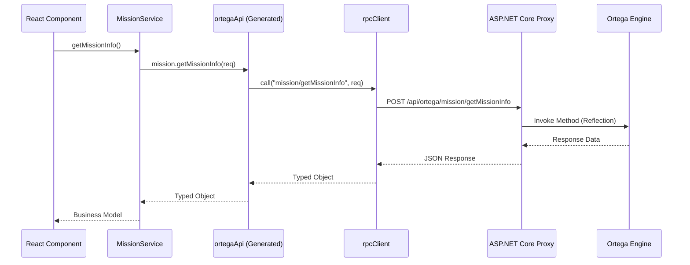

# Ortega API 代理系统使用指南

## 概述

Ortega API 代理系统会自动包装所有来自 `MementoMori.Ortega` 的游戏后端接口。该系统通过 C# 后端自动扫描 API 并生成前端 RPC 客户端，实现了类型安全、零手动配置的接口调用。

## 工作原理

1.  **API 发现**：后端启动时自动扫描标记了 `[OrtegaApi]` 特性的 Request 类型。
2.  **代码生成**：通过 `pnpm generate-types` 命令，后端会生成：
    *   `src/api/generated/`：所有请求/响应的 TypeScript 接口。
    *   `src/api/ortega-rpc-manifest.ts`：完整的 RPC 路由与类型映射表。
    *   `src/api/ortega-client.ts`：强类型的快捷调用对象。
3.  **动态代理**：前端通过统一的 `rpcClient` 将请求发送至 `/api/ortega/{category}/{action}`，后端利用反射调用对应的 Ortega 引擎方法。

### 调用流程图



## 前端调用方式

### 方式一：使用强类型快捷对象（推荐）

这是最常用的方式，代码提示最友好。

```typescript
import { ortegaApi } from '@/api/ortega-client';

// 获取用户数据
const userData = await ortegaApi.user.getUserData({});

// 获取任务信息
const missionInfo = await ortegaApi.mission.getMissionInfo({
  targetMissionGroupList: [1, 2] // 使用生成的枚举或 ID
});
```

### 方式二：使用通用调用接口

当你需要动态指定路由时，可以使用 `call` 方法，它依然保持了请求和响应的类型校验。

```typescript
import { ortegaApi } from '@/api/ortega-client';

// 传入 URI 字符串，IDE 会根据 URI 自动推断 request 和 response 的类型
const response = await ortegaApi.call("shop/getList", {
  // 这里会有类型提示
});
```

## 代码生成

每当 C# 后端的 Ortega 接口发生变化（新增 API 或修改字段）时，必须运行以下命令更新前端定义：

```bash
pnpm generate-types
```

该命令会同步更新以下文件：
*   `src/api/generated/*.ts`
*   `src/api/ortega-rpc-manifest.ts`
*   `src/api/ortega-client.ts`

> [!CAUTION]
> **严禁手动修改** 上述由生成的代码文件。任何手动修改都会在下次运行生成命令时被覆盖。

## 认证与 Header

系统通过 `axios-client` 的请求拦截器自动处理认证。
*   所有请求都会自动携带 `X-User-Id`（从 `accountStore` 获取）。
*   后端 `OrtegaProxyController` 会验证该 ID 并将其注入到 Ortega 引擎上下文中。

## 错误处理

代理系统会捕获 Ortega 引擎抛出的异常并将其包装为标准错误响应。

```typescript
try {
  const response = await ortegaApi.battle.pvpStart({ ... });
} catch (error: any) {
  if (error.response?.data?.errorCode) {
    // 处理 Ortega 特有的错误码
    const { errorCode, error: errorMsg } = error.response.data;
    console.error(`游戏逻辑错误 [${errorCode}]: ${errorMsg}`);
  } else {
    // 处理网络或其他系统错误
    console.error("系统错误:", error.message);
  }
}
```

## 特殊数据处理

### 字典类型的 Key
Ortega API 经常返回以数字 ID 为 Key 的字典。在 TypeScript 中，这些 Key 可能会被处理为字符串。建议使用以下方式安全访问：

```typescript
const groupInfo = missionData.missionInfoDict[groupType] 
               || missionData.missionInfoDict[groupType.toString()];
```

## 完整示例

```typescript
import { useEffect, useState } from 'react';
import { ortegaApi } from '@/api/ortega-client';
import { MissionGroupType, GetMissionInfoResponse } from '@/api/generated';

export function MyComponent() {
  const [data, setData] = useState<GetMissionInfoResponse | null>(null);

  const loadData = async () => {
    try {
      const res = await ortegaApi.mission.getMissionInfo({
        targetMissionGroupList: [MissionGroupType.Daily]
      });
      setData(res);
    } catch (e) {
      console.error("加载失败", e);
    }
  };

  useEffect(() => { loadData(); }, []);

  return (
    // ... 渲染逻辑
  );
}
```
