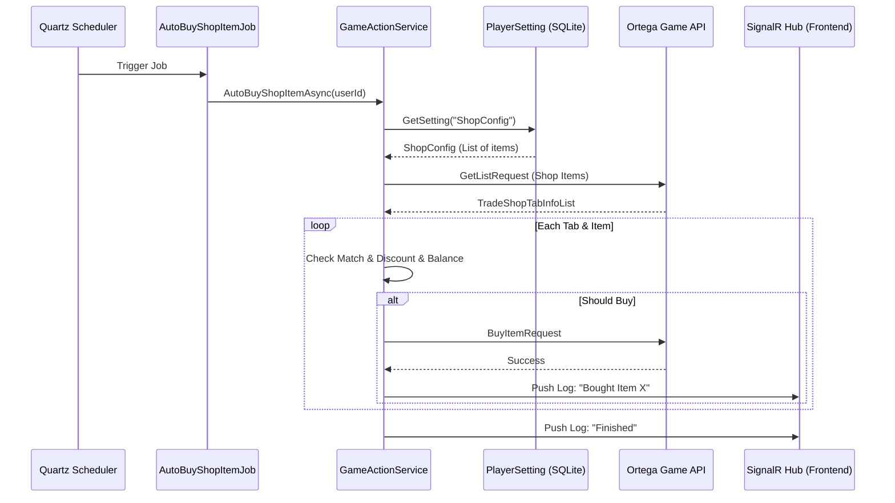

# 商店自动购买功能移植计划

## 目标
将旧版本的 `AutoBuyShopItemJob` 移植到新的 React + ASP.NET Core 架构中，支持按账户独立配置。

## 核心流程
1. **Quartz 触发**: 调度器根据 Cron 表达式触发 `AutoBuyShopItemJob`。
2. **逻辑处理**: `AutoBuyShopItemJob` 调用 `GameActionService.AutoBuyShopItemAsync`。
3. **数据交互**:
   - 从 `PlayerSettingService` 加载该账号的购买配置。
   - 调用 Ortega API 获取商店列表。
   - 匹配配置并执行购买操作。
4. **日志推送**: 通过 `JobLogger` 将详细执行过程推送至前端控制台。

## 后端待修改项

### 1. `api/MementoMori.Api/Extensions/UserSyncDataExtensions.cs` (新增)
提供 `GetUserItemCount` 扩展方法，用于判断余额是否充足。

### 2. `api/MementoMori.Api/Services/GameActionService.cs`
- 注入 `IServiceProvider` 以解决单例服务访问作用域服务（`PlayerSettingService`）的问题。
- 实现 `AutoBuyShopItemAsync(long userId)`：
  - 加载 `ShopConfig` 设置。
  - 请求 `GetListRequest` (商店列表)。
  - 请求 `GetWeeklyTopicsInfoRequest` (周活动商店)。
  - 循环遍历物品：
    - 检查是否售罄 (`IsSoldOut`)。
    - 检查是否免费 (`IsFree`)。
    - 匹配 `AutoBuyItems` 中的 TabID、物品 ID、折扣要求。
    - 执行 `BuyItemRequest`。

### 3. `api/MementoMori.Api/Jobs/AutoBuyShopItemJob.cs` (新增)
- 继承 `AccountJobBase`。
- 在 `ExecuteAsync` 中调用 `GameActionService.AutoBuyShopItemAsync`。

### 4. `api/MementoMori.Api/Services/JobManagerService.cs`
- 在 `RegisterUserJobsAsync` 中添加 `AutoBuyShopItemJob` 的注册逻辑。
- 读取 `AutoJobModel.AutoBuyShopItemJobCron` 配置。

## 前端待修改项

### 1. `src/components/account/AutomationManager.tsx`
- 在任务列表中增加“自动购买商店物品”的一行。
- 增加开关控制（对接 `AutoJobModel`）。
- (可选) 增加一个按钮，弹出对话框管理 `ShopConfig` (自动购买的具体物品清单)。

## Mermaid 逻辑图

