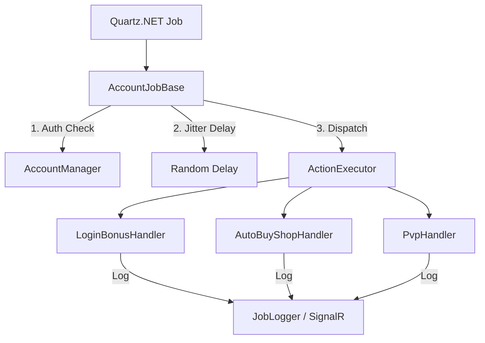

# PLAN-Automation-Refactoring: 自动任务系统重构与增强计划

本计划旨在优化 MementoMori 自动任务系统的架构，解决现有实现中的耦合度高、健壮性不足以及缺乏模拟人类行为等问题。

## 1. 核心目标

*   **解耦**: 消除 `GameActionService` 的“上帝类”趋势，将动作拆分为独立的 `Handler`。
*   **健壮性**: 引入自动重登录保护，确保 Session 失效时任务不中断。
*   **安全性**: 引入随机执行抖动（Random Jitter），模拟人类行为，降低封号风险。
*   **扩展性**: 标准化任务流，方便快速接入 PVP、爬塔、公会战等新功能。

## 2. 架构设计

### 2.1 任务处理模型

### 2.2 关键组件定义

*   **`IGameActionHandler`**: 游戏动作接口，定义统一的 `ExecuteAsync` 入口。
*   **`AccountJobBase`**: 增强型基类，处理通用的身份校验、自动重连和随机延迟逻辑。
*   **`ActionExecutor`**: 协调器，根据用户配置顺序执行一组 Handler。

## 3. 实施步骤

### 第一阶段：基础设施与基类增强
- [ ] 增强 `AccountContext`：支持自动刷新 Session。
- [ ] 增强 `AccountJobBase`：
    - 实现 `EnsureLoggedInAsync`：检查并自动修复登录状态。
    - 实现 `RandomJitterAsync`：在任务开始前随机等待（0-60s）。

### 第二阶段：逻辑解耦与迁移
- [ ] 定义 `IGameActionHandler` 接口。
- [ ] 迁移现有逻辑：
    - `DailyLoginBonusHandler` (从 `GameActionService` 迁移)。
    - `ShopAutoBuyHandler` (从 `GameActionService` 迁移)。
- [ ] 重构 `GameActionService` 作为一个轻量级的 Handler 容器。

### 第三阶段：任务流优化
- [ ] 引入 `CompositeActionHandler`：支持串行执行多个动作。
- [ ] 错误处理机制：在 Handler 级别增加异常捕获和简单的重试策略。

### 第四阶段：功能扩展
- [ ] 实现 `PvpActionHandler` (竞技场)。
- [ ] 实现 `TowerActionHandler` (爬塔)。

## 4. 预期收益
1.  **高内聚低耦合**：每个 Handler 只负责一个业务点。
2.  **更高的自动化成功率**：通过自动登录保护减少手动干预。
3.  **更好的用户体验**：实时的任务日志反馈。
