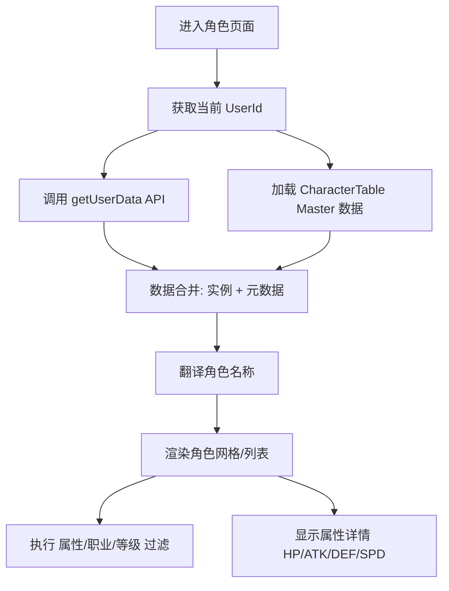

# CharactersPage 页面重构计划 (Real API Integration)

该计划旨在将 `src/pages/CharactersPage.tsx` 从 Mock 数据重构为使用真实的 Ortega API 和 Master 数据。

## 1. 数据来源设计

| 数据类型 | 来源 | 说明 |
| :--- | :--- | :--- |
| **角色实例数据** | `ortegaApi.user.getUserData` | 获取用户的 `userCharacterDtoInfos`，包含等级、稀有度标志、GUID 等。 |
| **角色元数据 (Master)** | `masterService.getTableData('CharacterTable')` | 获取 `CharacterMB` 列表，包含名称 Key、属性、职业、基础系数。 |
| **本地化** | `useTranslation` (来自 `useTranslationStore`) | 将 `NameKey` 和 `Name2Key` 翻译为真实名称。 |

## 2. 映射逻辑

### 属性 (ElementType)
- 1: 蓝 (Blue) -> 💧 忧蓝
- 2: 红 (Red) -> 🔥 业红
- 3: 绿 (Green) -> 🍃 苍翠
- 4: 黄 (Yellow) -> ⚡ 流金
- 5: 天 (Light) -> ☀️ 天光
- 6: 冥 (Dark) -> 🌙 幽冥

### 职业 (JobFlags)
- 1: Warrior -> ⚔️ 战士
- 2: Sniper -> 🏹 射手
- 4: Sorcerer -> 📖 法师

### 稀有度 (Rarity)
基于 `UserCharacterDtoInfo.rarityFlags` 和 `CharacterMB.RarityFlags` 的综合判断。

## 3. 核心流程

## 4. 待办事项 (TODO)

- [ ] **准备阶段**：分析 `UserCharacterDtoInfo` 和 `CharacterMB` 的属性对应关系。
- [ ] **数据获取**：在 `CharactersPage` 中集成 `ortegaApi.user.getUserData` 和 `CharacterTable` 的获取逻辑。
- [ ] **数据处理**：实现合并用户角色实例数据与 Master 元数据的逻辑，并处理本地化翻译。
- [ ] **过滤器重构**：将硬编码的属性/职业/稀有度过滤器替换为基于枚举值（`ElementType`, `JobFlags`）的逻辑。
- [ ] **UI 渲染更新**：使用真实数据替换角色网格和列表视图中的 mock 数据。
- [ ] **详情弹窗重构**：更新角色详情对话框，展示真实的属性系数、技能占位符和进化路径。
- [ ] **测试验证**：确保在切换账号后角色数据能正确更新并显示。

## 5. 限制与说明
- **战力 (Battle Power)**: 初期仅展示基础属性，暂不实现复杂的战力计算逻辑。
- **图标**: 暂时保留 Emoji 或简单的占位符，待后续资源系统完善后再更新真实图片。
