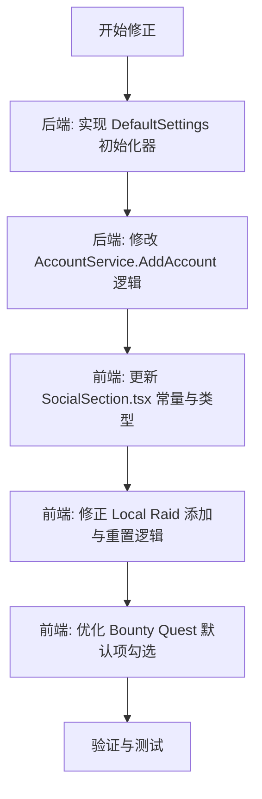

# Local Raid & Social Settings 迁移修正计划

## 1. 问题分析
老版本 `LocalRaidSettings.razor` 具有以下核心特性，而在当前 `SocialSection.tsx` 中实现有误或缺失：
- **权重系统**：不仅是选择项，每个项都有特定的默认权重（如符石兑换券为 4.0，强化水为 1.0）。
- **初始化逻辑**：当用户配置为空时，会自动从全局配置或硬编码的默认值中加载这 5 项。
- **任务选择算法**：后端根据 `RewardCount / MaxItemCount * Weight` 来计算每个任务的分数，从而选择最优任务。新版本 UI 需要确保用户理解并能正确配置这些权重。

## 2. 修正方案

### 2.1 后端初始化 (增强)
为了响应用户建议，在添加账号时自动完成初始化：
- 修改 `AccountService.cs`，在成功添加账号后，调用 `PlayerSettingService` 为该账号写入默认的 `localraid` 和 `bountyquestauto` 配置。

### 2.2 前端 `SocialSection.tsx` 逻辑对齐
- **更新常量定义**：将 `localRaidCommonRewards` 扩展为包含 `weight` 的对象。
- **完善添加逻辑**：`addLocalRaidReward` 函数应保留预设的权重值。
- **自动初始化检查**：在 `SocialSection` 组件加载时，若发现 `rewardItems` 为空且是当前活跃账户，则提示或自动填充默认值。
- **UI 增强**：
    - 在权重输入框旁增加简要说明。
    - 修正“重置为默认”按钮，使其填充完整的 5 项带权重的奖励。

## 3. 实施步骤

### 具体代码变更点预估：

#### 后端 (`MementoMori.Api`)
- `Models/GameConfig.cs`: 确保 `WeightedItem` 和 `LocalRaidConfig` 具有正确的默认构造或静态默认值。
- `Services/AccountService.cs`: 在 `AddAccount` 流程末尾加入初始化逻辑。

#### 前端 (`src/components/settings`)
- `SocialSection.tsx`:
    - 修改 `localRaidCommonRewards`。
    - 优化 `addLocalRaidReward`。
    - 改进 `localRaid.rewardItems.map` 中的渲染逻辑，特别是权重的步进值 (step="0.1")。

## 4. 确认
您是否同意：
1. 在后端 `AccountService` 中直接处理初始化（这样以后任何新账号都会有默认值）？
2. 在前端 `SocialSection.tsx` 中保留“一键重置”功能，以便用户误删后恢复？
