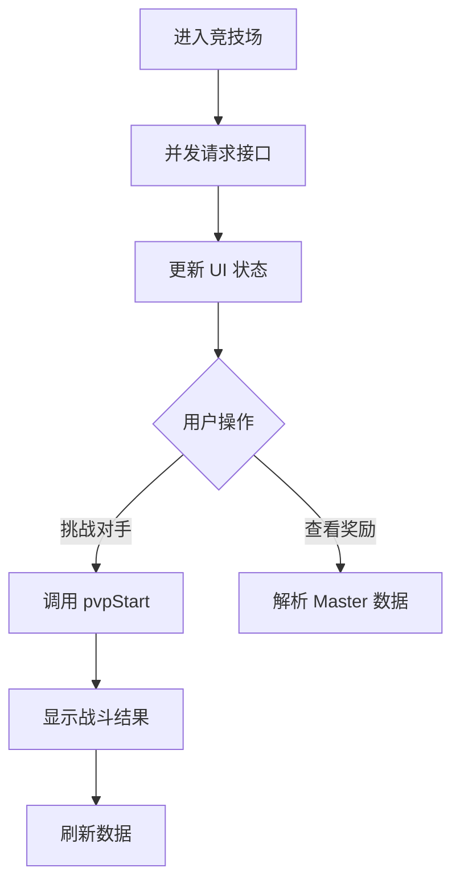

# PLAN-PVPPage: 竞技场页面数据集成计划

本计划旨在将 `src/pages/PVPPage.tsx` 从 Mock 数据切换为通过接口获取的真实数据。

## 1. 核心接口与数据映射

### 1.1 接口列表
- **PVP 基础信息**: `ortegaApi.battle.getPvpInfo({ isRankingTab: false })`
    - 返回：`currentRank` (当前排名), `matchingRivalList` (对手列表), `topRankerList` (前几名列表)。
- **用户 PVP 状态**: `ortegaApi.user.getUserData({})`
    - 路径：`response.userSyncData.userBattlePvpDtoInfo`
    - 字段：`pvpTodayCount` (今日挑战次数), `maxRanking` (历史最高排名)。
- **奖励配置 (Master Data)**: `TowerBattleQuestMB` (Master 表)
    - 过滤条件：`pvpRankingRewardType === 0` (普通竞技场每日排名奖励)。
- **对战功能**: `ortegaApi.battle.pvpStart({ rivalPlayerId: number })`

### 1.2 UI 数据对应关系
- **当前排名卡片**: `currentRank`
- **今日剩余次数卡片**: `5 - pvpTodayCount` (每日免费次数为 5)
- **历史最高排名卡片**: `maxRanking`
- **对手列表**: 渲染 `matchingRivalList` 中的 `PvpRankingPlayerInfo`
- **奖励列表**: 渲染 `PvpRankingRewardMB` 经过过滤后的数据

## 2. 功能设计

### 2.1 挑战逻辑
1. 点击对手旁边的“挑战”按钮。
2. 调用 `ortegaApi.battle.pvpStart`。
3. 处理结果：
    - 胜利/失败提示。
    - 排名变化提示（`afterRank`）。
    - 自动刷新页面数据以更新挑战次数和最新排名。

### 2.2 奖励解析
- 使用 `useMasterTable` 加载配置。
- 奖励道具名称通过 `useTranslation` 的 `[ItemName_{id}]` 或 `useItemName` hook 获取。

### 2.3 记录占位
- 由于当前无查询历史战绩的 RPC 接口，历史记录页签将保留现有的 UI 结构作为占位，并显示“暂无近期记录”。

## 3. 实施步骤

1. **环境准备**:
    - 导入 `ortegaApi`。
    - 导入必要的 DTO 类型定义。
2. **状态管理**:
    - `useState` 定义：`pvpInfo` (排名与列表), `userPvpDto` (次数与最高排名), `loading` (加载状态)。
3. **副作用实现**:
    - `useEffect` 加载数据，整合 `getPvpInfo` 和 `getUserData`。
4. **组件渲染**:
    - 更新 `PVPPage` 的 JSX，替换 `mockPVPOpponents`。
    - 动态生成奖励列表。
5. **交互逻辑**:
    - 实现 `handleChallenge` 函数。
    - 添加战斗后的数据刷新逻辑。

## 4. 流程图

