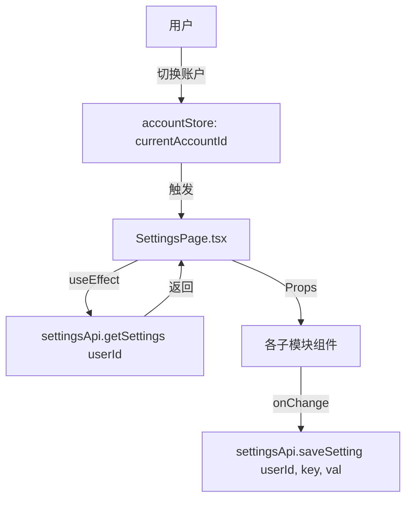

# Settings 模块迁移方案 (Blazor -> React)

本文档旨在规划将 MementoMori 游戏的设置组件从 Blazor 架构迁移到 React + TypeScript 架构。

## 1. 核心变更点：全量账户化 (Per-Account)

根据业务需求，迁移后的所有配置项均不再区分“全局”与“账户”，而是**统一绑定到特定的账户 (Account-Level)**。
这意味着即使是原本在 Blazor 中标记为 Global 的 `AutoJob` 设置，在 React 中也将针对每个账户独立存储。

## 2. 模块划分与映射

我们将 `SettingsPage.tsx` 划分为以下主要模块：

| React 模块 | 对应 Razor 组件 | 存储 Key | 主要功能 |
| :--- | :--- | :--- | :--- |
| **自动化设置 (`AutomationSection`)** | `AutoJobSwitch`, `AutoJobCron` | `autojob` | 自动任务开关、Cron 表达式配置 |
| **战斗设置 (`BattleSection`)** | `PvpSettings`, `DungeonBattleSettings` | `battleleague`, `legendleague`, `dungeonbattle` | PVP 过滤/策略、地牢偏好、折扣购买 |
| **社交与团队 (`SocialSection`)** | `FriendManageSettings`, `LocalRaidSettings` | `friendmanage`, `localraid` | 好友删减/接受、团队战权重与房间策略 |
| **资源与物品 (`ResourceSection`)** | `ShopSettings`, `GachaSettings`, `ItemsSetting` | `shop`, `gacha`, `items` | 商店自购列表、抽卡目标、物品自动使用 |
| **任务与公会 (`MiscSection`)** | `GuildTowerSettings`, `BountyQuest` | `guildtower`, `bountyquest` | 公会塔挑战策略、悬赏任务刷新逻辑 |

## 3. 技术实现架构

### 3.1 数据流设计


### 3.2 API 层 (`src/api/settings-service.ts`)
```typescript
export const settingsApi = {
    // 获取指定账户的所有或特定配置
    getSetting: async <T>(userId: number, key: string): Promise<T> => {
        const response = await apiClient.get<T>(`/api/settings/${userId}/${key}`);
        return response.data;
    },
    // 保存特定模块配置
    saveSetting: async (userId: number, key: string, value: any) => {
        return await apiClient.post(`/api/settings/${userId}/${key}`, value);
    }
};
```

### 3.3 UI 组织方案
*   **布局**: 使用 `Tabs` 组件进行一级分类。
*   **交互**: 
    *   简单的开关使用 `Switch` + `Label`。
    *   复杂配置（如角色过滤器、自购列表）使用弹窗 `Dialog` 或嵌入式列表管理。
    *   账户切换时显示全局加载状态 (`Skeleton` 或 `Spinner`)。

## 4. 逻辑迁移细节

### 4.1 PVP 过滤器逻辑
*   需要实现 `CharacterFilter` 数据结构的编辑。
*   支持按角色 ID 选择（需配合 `MasterData` 获取角色名称和头像）。
*   支持策略选择（按角色排除/按属性战力比较）。

### 4.2 商店/地牢折扣逻辑
*   维护一个 `ShopDiscountItem` 数组。
*   支持通过下拉框选择物品类型，并设置折扣阈值。

### 4.3 Cron 表达式编辑
*   提供预设 Cron 的快捷恢复功能（Reset to Default）。
*   链接到外部 Cron 生成器（如 Blazor 中原有的 Help 链接）。

## 5. 开发顺序

1.  **基础设施**: 创建 `settings-service.ts` 和通用的表单包装组件。
2.  **核心模块实现**: 按照 `Automation` -> `Battle` -> `Resource` -> `Social` 的顺序逐个开发。
3.  **集成联调**: 在 `SettingsPage.tsx` 中完成账户切换与配置预加载的闭环。
4.  **本地化**: 补齐翻译词条。
