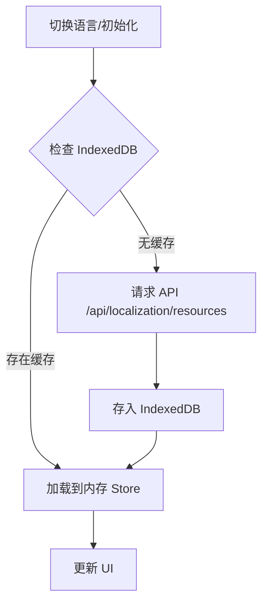

# 翻译文件 IndexedDB 存储方案

本方案旨在将前端翻译资源从 `localStorage` 迁移到 `IndexedDB`，并统一本地化管理逻辑。

## 1. 目标
- 解决 `localStorage` 空间限制问题（翻译资源文件通常较大）。
- 统一 `useTranslationStore` 和 `useLocalizationStore`。
- 提高资源加载速度，减少不必要的 API 请求。

## 2. 详细设计

### 2.1 IndexedDB 扩展
在 `src/lib/db.ts` 中增加 `translations` 表：
- **TableName**: `translations`
- **Key**: `lang` (如 `zhCN`, `jaJP`)
- **Fields**: 
  - `lang`: string (Primary Key)
  - `resources`: Record<string, string>
  - `lastUpdated`: number

### 2.2 Store 统一化
将 `src/hooks/useTranslation.ts` 中的逻辑整合进 `src/store/localization-store.ts`。

**统一后的 `useLocalizationStore` 职责：**
- 管理当前语言状态。
- 负责从 IndexedDB 或 API 加载资源。
- 提供翻译函数 `t(key, params)`。

### 2.3 加载流程

## 3. 实施步骤

1.  **[ ] 修改 `src/lib/db.ts`**:
    - 升级数据库版本。
    - 添加 `translations` 表定义。
2.  **[ ] 重构 `src/store/localization-store.ts`**:
    - 引入 `db` 实例。
    - 修改 `fetchResources` 逻辑。
    - 整合 C# 风格占位符处理代码。
3.  **[ ] 重构 `src/hooks/useTranslation.ts`**:
    - 移除旧的 `useTranslationStore`。
    - 将 `useTranslation` hook 重新导向 `useLocalizationStore`。
4.  **[ ] 清理工作**:
    - 移除不再需要的 `localStorage` 数据。

## 4. 后续优化建议
- **哈希校验**: 后端在 `manifest` 中包含翻译文件的哈希，前端据此判断是否需要更新 IndexedDB 缓存。
- **预加载**: 在应用闲置时预加载其他常用语言。
