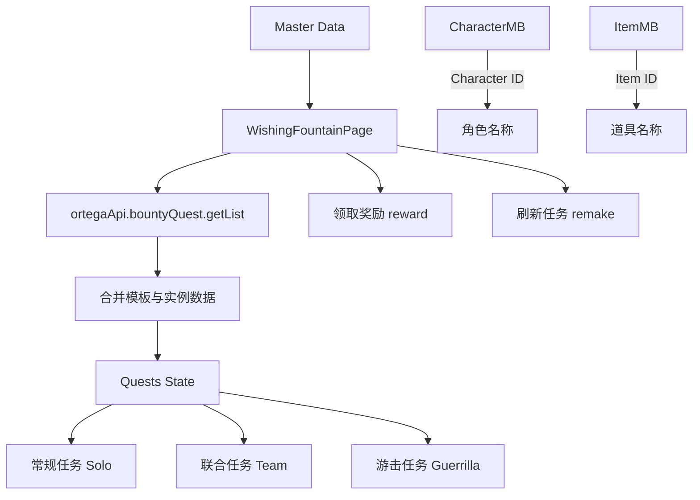

# 祈愿之泉 (Wishing Fountain) 对接真实数据实施计划

本计划旨在将 `src/pages/WishingFountainPage.tsx` 中的 Mock 数据替换为从后端接口获取的真实任务数据，并实现基本的操作功能。

## 1. 核心接口与数据结构

### 1.1 Ortega API 接口
- **获取任务列表**: `ortegaApi.bountyQuest.getList({})`
  - 返回 `bountyQuestInfos`: 任务模板（ID、名称、稀有度、派遣条件、奖励）。
  - 返回 `userBountyQuestDtoInfos`: 用户当前任务实例（开始时间、结束时间、是否已领取）。
- **领取奖励**: `ortegaApi.bountyQuest.reward({ bountyQuestIds, isQuick, consumeCurrency })`
- **刷新任务**: `ortegaApi.bountyQuest.remake({})`

### 1.2 数据模型合并
由于 API 将静态模板和动态进度分开返回，需要根据 `bountyQuestId` 进行前端合并：
```typescript
interface ProcessedQuest {
    id: number;
    name: string;
    type: BountyQuestType;
    rarity: BountyQuestRarityFlags;
    startTime: number; // Unix timestamp
    endTime: number;   // Unix timestamp
    isReward: boolean; // 是否已领取
    requirements: BountyQuestConditionInfo[];
    rewards: UserItem[];
    status: 'available' | 'ongoing' | 'completed';
}
```

## 2. 任务状态判定逻辑
- **completed (可领取)**: `isReward === false` 且 `now >= endTime`。
- **ongoing (进行中)**: `isReward === false` 且 `now < endTime` 且有 `startTime`。
- **available (可派遣)**: 未在 `userBountyQuestDtoInfos` 中找到对应的进行中实例。

## 3. 实施步骤

### Step 1: 基础框架搭建
- 引入 `useMasterTable` 加载 `CharacterMB` 和 `ItemMB`。
- 引入 `ortegaApi` 和 `useTranslation`。
- 实现 `fetchQuests` 数据获取函数。

### Step 2: UI 数据绑定
- 将三个 Tabs (常规、联合、游击) 分别绑定到过滤后的 `ProcessedQuest` 列表。
- 转换稀有度枚举 (`BountyQuestRarityFlags`) 为 UI 颜色。
- 转换道具 ID 为翻译后的名称。

### Step 3: 功能实现
- **定时器**: 使用 `useEffect` 实现秒级倒计时，更新 `ongoing` 任务的进度。
- **一键领取**: 收集所有 `completed` 状态的 ID 并调用 `reward` 接口。
- **刷新任务**: 调用 `remake` 并重新获取数据。

### Step 4: 细节优化
- 完善派遣条件（属性、稀有度）的显示。
- 优化空状态和加载状态的 UI 展示。

## 4. 预期效果
- 页面实时反映游戏内的远征进度。
- 用户可以直接通过网页领取完成的任务奖励。
- 能够通过钻石刷新常规任务。

## 5. Mermaid 流程图

