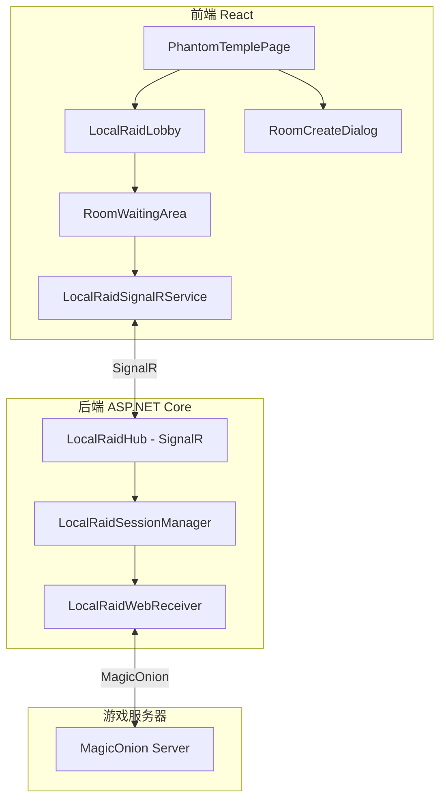
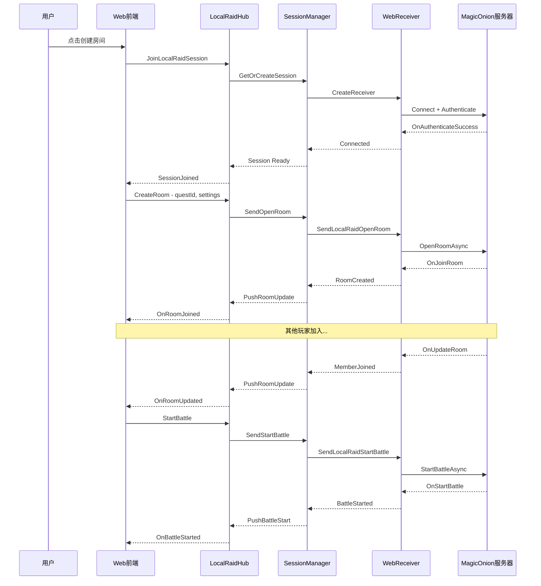

# LocalRaid Web 功能实现计划

## 概述

将幻影神殿（LocalRaid）的组队挑战功能实现到 Web 前端，允许用户通过网页界面进行：
- 创建/加入房间
- 设置房间条件（战斗力要求、密码、自动开始）
- 邀请好友
- 准备/开始战斗
- 实时查看房间状态

## 现有架构分析

### 后端现有实现

1. **MagicOnion 客户端** ([`OrtegaMagicOnionClient.cs`](api/MementoMori.Ortega/Network/MagicOnion/Client/OrtegaMagicOnionClient.cs))
   - 与游戏服务器的实时通信
   - 支持 LocalRaid 所有操作

2. **LocalRaidHandler** ([`LocalRaidHandler.cs`](api/MementoMori.Api/Handlers/LocalRaid/LocalRaidHandler.cs))
   - 自动化 LocalRaid 逻辑
   - 支持自建房间和加入随机房间两种模式

3. **LocalRaidReceivers** ([`LocalRaidReceivers.cs`](api/MementoMori.Api/Handlers/LocalRaid/LocalRaidReceivers.cs))
   - `LocalRaidBaseReceiver` - 基础接收器
   - `LocalRaidJoinRoomReceiver` - 加入房间模式
   - `LocalRaidCreateRoomReceiver` - 创建房间模式

4. **SignalR JobHub** ([`JobHub.cs`](api/MementoMori.Api/Infrastructure/JobHub.cs))
   - 现有的任务日志推送
   - 可扩展用于 LocalRaid 实时通信

### 前端现有实现

1. **PhantomTemplePage** ([`PhantomTemplePage.tsx`](src/pages/PhantomTemplePage.tsx))
   - 数据展示已实现
   - 挑战功能按钮已预留

2. **useLocalRaidInfo** ([`useLocalRaidInfo.ts`](src/hooks/useLocalRaidInfo.ts))
   - 获取任务、敌人、奖励信息

## 技术架构设计

### 整体架构



### 数据流设计



## 详细设计

### 1. 后端 SignalR Hub

#### LocalRaidHub.cs

```csharp
/// <summary>
/// LocalRaid 实时通信 Hub
/// </summary>
public class LocalRaidHub : Hub
{
    // 连接到 LocalRaid 会话
    public async Task JoinLocalRaidSession();
    
    // 离开会话
    public async Task LeaveLocalRaidSession();
    
    // 获取房间列表
    public async Task GetRoomList(long questId);
    
    // 创建房间
    public async Task CreateRoom(CreateRoomRequest request);
    
    // 加入房间
    public async Task JoinRoom(JoinRoomRequest request);
    
    // 随机加入
    public async Task JoinRandomRoom(long questId);
    
    // 准备
    public async Task SetReady(bool isReady);
    
    // 开始战斗
    public async Task StartBattle();
    
    // 离开房间
    public async Task LeaveRoom();
    
    // 更新房间条件
    public async Task UpdateRoomCondition(UpdateRoomConditionRequest request);
    
    // 邀请好友
    public async Task InviteFriend(long friendPlayerId);
}

// 推送给客户端的事件
public interface ILocalRaidClient
{
    // 会话已连接
    Task OnSessionJoined(LocalRaidSessionInfo info);
    
    // 房间列表更新
    Task OnRoomListReceived(List<LocalRaidPartyInfo> rooms);
    
    // 已加入房间
    Task OnRoomJoined(LocalRaidPartyInfo roomInfo);
    
    // 房间更新（成员变化等）
    Task OnRoomUpdated(LocalRaidPartyInfo roomInfo);
    
    // 战斗开始
    Task OnBattleStarted();
    
    // 房间解散
    Task OnRoomDisbanded();
    
    // 被踢出
    Task OnRefused();
    
    // 错误
    Task OnError(LocalRaidError error);
    
    // 被邀请
    Task OnInvited(InviteInfo invite);
}
```

### 2. 后端会话管理

#### LocalRaidSessionManager.cs

```csharp
/// <summary>
/// 管理 LocalRaid 会话
/// 每个 Web 用户对应一个 MagicOnion 连接
/// </summary>
public class LocalRaidSessionManager
{
    // 用户ID -> 会话
    private readonly ConcurrentDictionary<long, LocalRaidSession> _sessions;
    
    // 获取或创建会话
    public async Task<LocalRaidSession> GetOrCreateSession(long userId, NetworkManager nm);
    
    // 移除会话
    public async Task RemoveSession(long userId);
    
    // 获取会话
    public LocalRaidSession? GetSession(long userId);
}

/// <summary>
/// 单个用户的 LocalRaid 会话
/// </summary>
public class LocalRaidSession : IDisposable
{
    public long UserId { get; }
    public OrtegaMagicOnionClient Client { get; }
    public LocalRaidWebReceiver Receiver { get; }
    public LocalRaidPartyInfo? CurrentRoom { get; set; }
    public bool IsConnected => Client.GetState() == HubClientState.Ready;
    
    // 发送操作
    public void SendOpenRoom(LocalRaidRoomConditionsType type, long questId, long requiredPower, int password);
    public void SendJoinRoom(string roomId, int password);
    public void SendJoinRandomRoom(long questId);
    public void SendReady(bool isReady);
    public void SendStartBattle();
    public void SendLeaveRoom();
    public void SendGetRoomList(long questId);
}
```

### 3. 后端 Web 接收器

#### LocalRaidWebReceiver.cs

```csharp
/// <summary>
/// Web 端的 LocalRaid 接收器
/// 将 MagicOnion 事件转发到 SignalR
/// </summary>
public class LocalRaidWebReceiver : IMagicOnionLocalRaidReceiver, IMagicOnionErrorReceiver
{
    private readonly long _userId;
    private readonly IHubContext<LocalRaidHub> _hubContext;
    private readonly LocalRaidSessionManager _sessionManager;
    
    // 实现 IMagicOnionLocalRaidReceiver 接口
    public void OnJoinRoom(OnJoinRoomResponse response)
    {
        var session = _sessionManager.GetSession(_userId);
        if (session != null)
        {
            session.CurrentRoom = response.LocalRaidPartyInfo;
        }
        
        _hubContext.Clients.User(_userId.ToString())
            .SendAsync("OnRoomJoined", response.LocalRaidPartyInfo);
    }
    
    public void OnUpdateRoom(OnUpdateRoomResponse response)
    {
        var session = _sessionManager.GetSession(_userId);
        if (session != null)
        {
            session.CurrentRoom = response.LocalRaidPartyInfo;
        }
        
        _hubContext.Clients.User(_userId.ToString())
            .SendAsync("OnRoomUpdated", response.LocalRaidPartyInfo);
    }
    
    public void OnStartBattle()
    {
        _hubContext.Clients.User(_userId.ToString())
            .SendAsync("OnBattleStarted");
    }
    
    public void OnDisbandRoom()
    {
        _hubContext.Clients.User(_userId.ToString())
            .SendAsync("OnRoomDisbanded");
    }
    
    public void OnError(ErrorCode errorCode)
    {
        _hubContext.Clients.User(_userId.ToString())
            .SendAsync("OnError", new LocalRaidError
            {
                ErrorCode = (int)errorCode,
                Message = Masters.TextResourceTable.GetErrorCodeMessage(errorCode)
            });
    }
    
    // ... 其他方法实现
}
```

### 4. 状态恢复机制

由于去掉了 REST API，页面刷新后的状态恢复通过以下方式实现：

1. **前端状态持久化** - 使用 sessionStorage 保存当前房间信息
2. **SignalR 重连后同步** - 连接建立后请求服务器同步当前状态
3. **Hub 新增方法** - `GetCurrentState()` 用于恢复状态

```csharp
// LocalRaidHub 新增方法
public async Task<LocalRaidSessionState> GetCurrentState()
{
    var session = _sessionManager.GetSession(UserId);
    if (session == null || !session.IsConnected)
    {
        return new LocalRaidSessionState { IsConnected = false };
    }
    
    return new LocalRaidSessionState
    {
        IsConnected = true,
        CurrentRoom = session.CurrentRoom,
        IsInRoom = session.CurrentRoom != null
    };
}
```

### 5. 前端 SignalR 服务

#### localRaidSignalRService.ts

```typescript
import * as signalR from '@microsoft/signalr';

export interface LocalRaidPartyInfo {
    roomId: string;
    leaderPlayerId: number;
    leaderPlayerName: string;
    questId: number;
    memberCount: number;
    maxMemberCount: number;
    requiredBattlePower: number;
    conditionsType: LocalRaidRoomConditionsType;
    isReady: boolean;
    members: PartyMemberInfo[];
}

export interface LocalRaidError {
    errorCode: number;
    message: string;
}

class LocalRaidSignalRService {
    private connection: signalR.HubConnection | null = null;
    private listeners: Map<string, Set<Function>> = new Map();
    
    async connect(): Promise<void>;
    async disconnect(): Promise<void>;
    
    // 发送操作
    async joinSession(): Promise<void>;
    async leaveSession(): Promise<void>;
    async getRoomList(questId: number): Promise<void>;
    async createRoom(request: CreateRoomRequest): Promise<void>;
    async joinRoom(request: JoinRoomRequest): Promise<void>;
    async joinRandomRoom(questId: number): Promise<void>;
    async setReady(isReady: boolean): Promise<void>;
    async startBattle(): Promise<void>;
    async leaveRoom(): Promise<void>;
    
    // 事件监听
    on(event: 'roomJoined', callback: (room: LocalRaidPartyInfo) => void): void;
    on(event: 'roomUpdated', callback: (room: LocalRaidPartyInfo) => void): void;
    on(event: 'battleStarted', callback: () => void): void;
    on(event: 'roomDisbanded', callback: () => void): void;
    on(event: 'error', callback: (error: LocalRaidError) => void): void;
    on(event: 'roomList', callback: (rooms: LocalRaidPartyInfo[]) => void): void;
    
    off(event: string, callback: Function): void;
}

export const localRaidSignalRService = new LocalRaidSignalRService();
```

### 6. 前端组件设计

#### 组件结构

```
PhantomTemplePage.tsx
├── LocalRaidStatusCard - 状态卡片（已有）
├── QuestList - 任务列表（已有）
│   └── QuestCard
│       └── ChallengeButton -> 打开 LocalRaidLobbyDialog
├── LocalRaidLobbyDialog - 组队大厅弹窗
│   ├── RoomList - 房间列表
│   ├── CreateRoomButton - 创建房间按钮
│   └── JoinRandomButton - 随机加入按钮
├── CreateRoomDialog - 创建房间设置弹窗
│   ├── QuestSelector - 任务选择
│   ├── AutoStartToggle - 自动开始开关
│   ├── BattlePowerInput - 战斗力要求
│   └── PasswordInput - 密码设置
└── RoomWaitingDialog - 房间等待弹窗
    ├── RoomInfo - 房间信息
    ├── MemberList - 成员列表
    ├── ReadyButton - 准备按钮
    └── StartButton - 开始按钮（房主）
```

#### LocalRaidLobbyDialog.tsx

```typescript
interface LocalRaidLobbyDialogProps {
    open: boolean;
    onOpenChange: (open: boolean) => void;
    questId: number;
    questInfo: LocalRaidQuestInfo;
}

export function LocalRaidLobbyDialog({ open, onOpenChange, questId, questInfo }: LocalRaidLobbyDialogProps) {
    const [rooms, setRooms] = useState<LocalRaidPartyInfo[]>([]);
    const [loading, setLoading] = useState(false);
    
    // 获取房间列表
    const refreshRooms = async () => {
        setLoading(true);
        await localRaidSignalRService.getRoomList(questId);
        // 房间列表通过事件回调设置
    };
    
    // 加入房间
    const handleJoinRoom = async (room: LocalRaidPartyInfo, password?: number) => {
        await localRaidSignalRService.joinRoom({ roomId: room.roomId, password });
    };
    
    // 随机加入
    const handleJoinRandom = async () => {
        await localRaidSignalRService.joinRandomRoom(questId);
    };
    
    return (
        <Dialog open={open} onOpenChange={onOpenChange}>
            <DialogContent className="max-w-3xl">
                <DialogHeader>
                    <DialogTitle>组队大厅 - {questInfo.name}</DialogTitle>
                </DialogHeader>
                
                <div className="space-y-4">
                    {/* 房间列表 */}
                    <div className="flex justify-between items-center">
                        <h3 className="font-semibold">招募中的队伍</h3>
                        <Button variant="outline" size="sm" onClick={refreshRooms}>
                            <RefreshCw className="h-4 w-4 mr-2" />
                            刷新
                        </Button>
                    </div>
                    
                    {rooms.length === 0 ? (
                        <div className="text-center py-8 text-muted-foreground">
                            目前没有队伍在招募，组建一支自己的队伍吧。
                        </div>
                    ) : (
                        <div className="space-y-2">
                            {rooms.map(room => (
                                <RoomCard key={room.roomId} room={room} onJoin={handleJoinRoom} />
                            ))}
                        </div>
                    )}
                    
                    {/* 操作按钮 */}
                    <div className="flex gap-2">
                        <Button className="flex-1" onClick={() => setShowCreateDialog(true)}>
                            <Plus className="h-4 w-4 mr-2" />
                            组建队伍
                        </Button>
                        <Button variant="outline" className="flex-1" onClick={handleJoinRandom}>
                            <Shuffle className="h-4 w-4 mr-2" />
                            随机加入
                        </Button>
                    </div>
                </div>
            </DialogContent>
        </Dialog>
    );
}
```

#### RoomWaitingDialog.tsx

```typescript
interface RoomWaitingDialogProps {
    open: boolean;
    onOpenChange: (open: boolean) => void;
}

export function RoomWaitingDialog({ open, onOpenChange }: RoomWaitingDialogProps) {
    const [roomInfo, setRoomInfo] = useState<LocalRaidPartyInfo | null>(null);
    const [isReady, setIsReady] = useState(false);
    const [battleStarted, setBattleStarted] = useState(false);
    
    // 监听 SignalR 事件
    useEffect(() => {
        const handleRoomUpdate = (room: LocalRaidPartyInfo) => setRoomInfo(room);
        const handleBattleStart = () => setBattleStarted(true);
        const handleDisband = () => {
            toast({ title: "房间已解散" });
            onOpenChange(false);
        };
        
        localRaidSignalRService.on('roomUpdated', handleRoomUpdate);
        localRaidSignalRService.on('battleStarted', handleBattleStart);
        localRaidSignalRService.on('roomDisbanded', handleDisband);
        
        return () => {
            localRaidSignalRService.off('roomUpdated', handleRoomUpdate);
            localRaidSignalRService.off('battleStarted', handleBattleStart);
            localRaidSignalRService.off('roomDisbanded', handleDisband);
        };
    }, []);
    
    const isLeader = roomInfo?.leaderPlayerId === currentPlayerId;
    
    const handleReady = async () => {
        await localRaidSignalRService.setReady(!isReady);
        setIsReady(!isReady);
    };
    
    const handleStart = async () => {
        await localRaidSignalRService.startBattle();
    };
    
    const handleLeave = async () => {
        await localRaidSignalRService.leaveRoom();
        onOpenChange(false);
    };
    
    if (battleStarted) {
        return <BattleProgressDialog open={open} />;
    }
    
    return (
        <Dialog open={open} onOpenChange={onOpenChange}>
            <DialogContent>
                <DialogHeader>
                    <DialogTitle>等待队友...</DialogTitle>
                </DialogHeader>
                
                <div className="space-y-4">
                    {/* 房间信息 */}
                    <div className="text-center">
                        <Badge variant="outline">房间ID: {roomInfo?.roomId}</Badge>
                    </div>
                    
                    {/* 成员列表 */}
                    <div className="grid grid-cols-3 gap-2">
                        {roomInfo?.members.map(member => (
                            <MemberCard 
                                key={member.playerId} 
                                member={member}
                                isLeader={member.playerId === roomInfo.leaderPlayerId}
                            />
                        ))}
                        {/* 空位 */}
                        {Array.from({ length: 3 - (roomInfo?.members.length || 0) }).map((_, i) => (
                            <div key={`empty-${i}`} className="border-2 border-dashed rounded-lg p-4 text-center text-muted-foreground">
                                等待加入...
                            </div>
                        ))}
                    </div>
                    
                    {/* 操作按钮 */}
                    <div className="flex gap-2">
                        {!isLeader && (
                            <Button 
                                className="flex-1" 
                                variant={isReady ? "secondary" : "default"}
                                onClick={handleReady}
                            >
                                {isReady ? "取消准备" : "准备"}
                            </Button>
                        )}
                        {isLeader && (
                            <Button 
                                className="flex-1" 
                                disabled={!roomInfo?.isReady}
                                onClick={handleStart}
                            >
                                开始战斗
                            </Button>
                        )}
                        <Button variant="outline" onClick={handleLeave}>
                            离开房间
                        </Button>
                    </div>
                </div>
            </DialogContent>
        </Dialog>
    );
}
```

## UI 设计细节（基于游戏截图）

### 房间等待界面（截图4）

```
┌─────────────────────────────────────────────────────────────┐
│  加入条件     ---这里是可选的条件---               [变更]      │
│  ┌─────────────────────────────────────────────────────┐    │
│  │ 总战斗力: 1,574,359                                  │
│  └─────────────────────────────────────────────────────┘    │
│                                                             │
│  ┌──────────────┐  ┌──────────────┐  ┌──────────────┐       │
│  │   [队长]     │  │  徵募队友    │  │  徵募队友    │       │
│  │  时间轴的交错 │  │              │  │              │       │
│  │   Lv.54      │  │   [邀请]     │  │   [邀请]     │       │
│  │ 战斗力:157万 │  │              │  │              │       │
│  │   未加入     │  │              │  │              │       │
│  └──────────────┘  └──────────────┘  └──────────────┘       │
│                                                             │
│  ┌─────────────────────────────────────────────────────┐    │
│  │           [解散]          [开始战斗]                │    │
│  └─────────────────────────────────────────────────────┘    │
└─────────────────────────────────────────────────────────────┘
```

**界面元素说明：**

1. **加入条件区域**
   - 显示总战斗力要求
   - 房主可点击"变更"按钮修改条件

2. **成员槽位（3个）**
   - 第一个槽位：房主信息（名称、等级、战斗力、公会状态）
   - 第二、三个槽位：空位显示"徵募队友"，带"邀请"按钮

3. **底部操作区**
   - 解散按钮：房主可解散房间
   - 开始战斗按钮：队员准备就绪后可点击

## 文件变更清单

### 可复用的数据模型（Ortega 项目已有）

**LocalRaid 数据模型** (`api/MementoMori.Ortega/Share/Data/LocalRaid/`)：
- [`LocalRaidPartyInfo`](api/MementoMori.Ortega/Share/Data/LocalRaid/LocalRaidPartyInfo.cs) - 房间信息
- [`LocalRaidBattleLogPlayerInfo`](api/MementoMori.Ortega/Share/Data/LocalRaid/LocalRaidBattleLogPlayerInfo.cs) - 玩家信息
- [`LocalRaidEnemyInfo`](api/MementoMori.Ortega/Share/Data/LocalRaid/LocalRaidEnemyInfo.cs) - 敌人信息
- [`LocalRaidQuestInfo`](api/MementoMori.Ortega/Share/Data/LocalRaid/LocalRaidQuestInfo.cs) - 任务信息
- [`LocalRaidBattleLogInfo`](api/MementoMori.Ortega/Share/Data/LocalRaid/LocalRaidBattleLogInfo.cs) - 战斗日志

**MagicOnion 请求类型（可直接用于 SignalR）**：
- [`OpenRoomRequest`](api/MementoMori.Ortega/Share/MagicOnionShare/Request/OpenRoomRequest.cs) - 创建房间（含 ConditionsType, Password, QuestId, RequiredBattlePower, IsAutoStart）
- [`JoinRoomRequest`](api/MementoMori.Ortega/Share/MagicOnionShare/Request/JoinRoomRequest.cs) - 加入房间（含 Password, RoomId）
- [`JoinRandomRoomRequest`](api/MementoMori.Ortega/Share/MagicOnionShare/Request/JoinRandomRoomRequest.cs) - 随机加入
- [`GetRoomListRequest`](api/MementoMori.Ortega/Share/MagicOnionShare/Request/GetRoomListRequest.cs) - 获取房间列表
- [`ReadyRequest`](api/MementoMori.Ortega/Share/MagicOnionShare/Request/ReadyRequest.cs) - 准备
- [`UpdateRoomConditionRequest`](api/MementoMori.Ortega/Share/MagicOnionShare/Request/UpdateRoomConditionRequest.cs) - 更新房间条件
- [`InviteRequest`](api/MementoMori.Ortega/Share/MagicOnionShare/Request/InviteRequest.cs) - 邀请

**MagicOnion 响应类型**：
- [`OnJoinRoomResponse`](api/MementoMori.Ortega/Share/MagicOnionShare/Response/OnJoinRoomResponse.cs) - 加入房间响应
- [`OnGetRoomListResponse`](api/MementoMori.Ortega/Share/MagicOnionShare/Response/OnGetRoomListResponse.cs) - 房间列表响应
- [`OnUpdateRoomResponse`](api/MementoMori.Ortega/Share/MagicOnionShare/Response/OnUpdateRoomResponse.cs) - 房间更新响应
- [`OnInviteResponse`](api/MementoMori.Ortega/Share/MagicOnionShare/Response/OnInviteResponse.cs) - 邀请响应
- [`OnUpdatePartyCountResponse`](api/MementoMori.Ortega/Share/MagicOnionShare/Response/OnUpdatePartyCountResponse.cs) - 队伍数量更新

### 需要新增的数据模型（仅 2 个）

```csharp
// api/MementoMori.Api/Models/LocalRaidModels.cs

namespace MementoMori.Api.Models;

/// <summary>
/// SignalR 连接状态
/// </summary>
public class LocalRaidSessionState
{
    public bool IsConnected { get; set; }
    public bool IsInRoom { get; set; }
    public LocalRaidPartyInfo? CurrentRoom { get; set; }
}

/// <summary>
/// 错误信息
/// </summary>
public class LocalRaidError
{
    public int ErrorCode { get; set; }
    public string Message { get; set; } = string.Empty;
}
```

### 后端新增文件

| 文件路径 | 说明 |
|---------|------|
| `api/MementoMori.Api/Models/LocalRaidModels.cs` | SignalR 通信 DTO（仅少量新增） |
| `api/MementoMori.Api/Services/LocalRaidSessionManager.cs` | 会话管理服务 |
| `api/MementoMori.Api/Handlers/LocalRaid/LocalRaidWebReceiver.cs` | Web 端接收器 |
| `api/MementoMori.Api/Infrastructure/LocalRaidHub.cs` | SignalR Hub |

### 后端修改文件

| 文件路径 | 修改内容 |
|---------|---------|
| `api/MementoMori.Api/Program.cs` | 注册 LocalRaidHub 和服务 |

### 前端新增文件

| 文件路径 | 说明 |
|---------|------|
| `src/api/localRaidSignalRService.ts` | SignalR 连接服务 |
| `src/components/localraid/LocalRaidLobbyDialog.tsx` | 组队大厅弹窗 |
| `src/components/localraid/CreateRoomDialog.tsx` | 创建房间弹窗 |
| `src/components/localraid/RoomWaitingDialog.tsx` | 等待房间弹窗 |
| `src/components/localraid/RoomCard.tsx` | 房间卡片组件 |
| `src/components/localraid/MemberCard.tsx` | 成员卡片组件 |
| `src/components/localraid/index.ts` | 导出文件 |

### 前端修改文件

| 文件路径 | 修改内容 |
|---------|---------|
| `src/pages/PhantomTemplePage.tsx` | 集成组队功能 |

## 实现步骤

### 第一阶段：后端基础设施

1. 创建 `LocalRaidModels.cs` - 数据模型定义
2. 创建 `LocalRaidSessionManager.cs` - 会话管理
3. 创建 `LocalRaidWebReceiver.cs` - 事件转发
4. 创建 `LocalRaidHub.cs` - SignalR Hub
5. 注册服务到 DI 容器

### 第二阶段：前端 SignalR 服务

1. 创建 `localRaidSignalRService.ts`
2. 实现连接管理
3. 实现事件监听机制

### 第三阶段：前端 UI 组件

1. 创建 `LocalRaidLobbyDialog.tsx` - 组队大厅
2. 创建 `CreateRoomDialog.tsx` - 创建房间
3. 创建 `RoomWaitingDialog.tsx` - 等待房间
4. 创建辅助组件（RoomCard、MemberCard）

### 第四阶段：集成与测试

1. 集成到 `PhantomTemplePage.tsx`
2. 端到端测试
3. 错误处理完善

## 注意事项

### 连接管理

1. **MagicOnion 连接生命周期**
   - 用户进入 LocalRaid 页面时建立连接
   - 用户离开页面时断开连接
   - 支持断线重连

2. **SignalR 连接管理**
   - 自动重连机制
   - 心跳保活

### 错误处理

1. **MagicOnion 错误码处理**
   - 参考文档中的错误码列表
   - 显示友好的错误提示

2. **网络异常处理**
   - 连接超时
   - 断线重连

### 性能考虑

1. **会话管理**
   - 限制单个用户的会话数量
   - 及时清理过期会话

2. **房间列表缓存**
   - 避免频繁请求房间列表

## 风险与缓解

| 风险 | 影响 | 缓解措施 |
|-----|------|---------|
| MagicOnion 连接不稳定 | 用户体验差 | 实现自动重连，显示连接状态 |
| 多账户同时操作 | 状态混乱 | 每个账户独立会话，互不干扰 |
| 战斗结果同步延迟 | 用户困惑 | 显示战斗进行中状态，轮询结果 |

## 后续扩展

1. **好友邀请功能**
   - 显示在线好友列表
   - 发送邀请通知

2. **快速匹配优化**
   - 根据战斗力智能匹配
   - 匹配队列显示

3. **战斗回放**
   - 保存战斗日志
   - 支持回放查看
