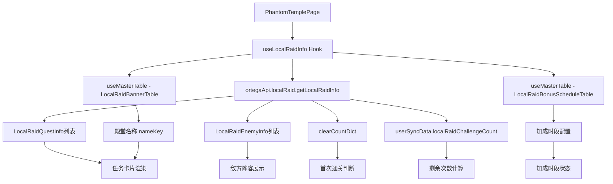

# 幻影神殿页面实现计划

## 概述

根据功能描述文档和 LocalRaid API 接口，实现幻影神殿页面的数据展示功能，暂时不实现挑战功能。

## 功能需求

### 核心功能
1. **顶部状态栏**：显示幻影等级、剩余挑战次数、奖励加成时段
2. **探索任务列表**：展示所有开放的殿堂任务
3. **任务详情弹窗**：显示敌方阵容、奖励信息
4. **战斗记录查看**：查看历史挑战记录

## 数据分析

### API 响应实例分析

根据 `getLocalRaidInfo` 接口响应实例：

```json
{
    "OpenLocalRaidQuestIds": [120002, 320005, 220006, 420009],
    "OpenEventLocalRaidQuestIds": [],
    "LocalRaidQuestInfos": [
        {
            "Id": 120002,
            "FirstBattleRewards": [
                {"ItemCount": 295050, "ItemId": 1, "ItemType": 3},
                {"ItemCount": 17510, "ItemId": 1, "ItemType": 11}
            ],
            "FixedBattleRewards": [
                {"ItemCount": 210750, "ItemId": 1, "ItemType": 3},
                {"ItemCount": 12507, "ItemId": 1, "ItemType": 11}
            ],
            "LocalRaidEnemyIds": [41200021, 41200022, 41200023, 41200024, 41200025],
            "Level": 2,
            "LocalRaidBannerId": 1,
            "RecommendedBattlePower": 1624470
        }
        // ... 更多任务
    ],
    "LocalRaidEnemyInfos": [
        {
            "Id": 41200021,
            "UnitIconType": 0,
            "UnitIconId": 32,
            "BattlePower": 324894,
            "ElementType": 4,
            "CharacterRarityFlags": 8,
            "EnemyRank": 115,
            "NameKey": "[CharacterName32]"
        }
        // ... 更多敌人
    ],
    "ClearCountDict": {},
    "UserSyncData": {
        "LocalRaidChallengeCount": 6
    }
}
```

### 数据映射关系

#### 殿堂名称映射 (LocalRaidBannerId -> NameKey -> 中文名)

| BannerId | NameKey | 中文名 |
|----------|---------|--------|
| 1 | [LocalRaidName1] | 智慧之殿 |
| 2 | [LocalRaidName2] | 慈悲之殿 |
| 3 | [LocalRaidName3] | 修道之殿 |
| 4 | [LocalRaidName4] | 善美之殿 |
| 5 | [LocalRaidName5] | 理解之殿 |

#### 奖励加成时段 (LocalRaidBonusScheduleMB)

```json
{
    "LocalRaidStartEndTimes": [
        {"StartTime": 123000, "EndTime": 133000},  // 12:30-13:30
        {"StartTime": 193000, "EndTime": 203000}   // 19:30-20:30
    ],
    "RewardBonusRate": 11000  // 110% 加成
}
```

#### 道具类型解析

| ItemType | 含义 |
|----------|------|
| 3 | 金币 (Gold) |
| 11 | 装备强化材料 |
| 12 | 觉醒材料 |

### 数据来源

#### API 接口
- [`ortegaApi.localRaid.getLocalRaidInfo()`](src/api/ortega-client.ts:337) - 获取幻影神殿基础信息
- [`ortegaApi.localRaid.getLocalRaidBattleLogs()`](src/api/ortega-client.ts:328) - 获取战斗记录

#### 关键数据结构

```typescript
// API 响应
interface LocalRaidGetLocalRaidInfoResponse {
    openLocalRaidQuestIds: number[];           // 开放的任务ID列表
    openEventLocalRaidQuestIds: number[];      // 开放的活动任务ID列表
    localRaidQuestInfos: LocalRaidQuestInfo[]; // 任务信息列表
    localRaidEnemyInfos: LocalRaidEnemyInfo[]; // 敌人信息列表
    clearCountDict: { [key: number]: number }; // 通关次数字典
    userSyncData: UserSyncData;                // 用户同步数据
}

// 任务信息
interface LocalRaidQuestInfo {
    id: number;
    firstBattleRewards: UserItem[];    // 首次通关奖励
    fixedBattleRewards: UserItem[];    // 固定奖励
    localRaidEnemyIds: number[];       // 敌人ID列表
    level: number;                     // 等级（用于显示星级）
    localRaidBannerId: number;         // 横幅ID（用于获取殿堂名称）
    recommendedBattlePower: number;    // 推荐战力
}

// 敌人信息
interface LocalRaidEnemyInfo {
    id: number;
    unitIconType: UnitIconType;        // 0=角色, 1=敌人
    unitIconId: number;                // 角色ID或敌人ID
    battlePower: number;               // 战力
    elementType: ElementType;          // 属性
    characterRarityFlags: CharacterRarityFlags;  // 稀有度
    enemyRank: number;                 // 敌人等级
    nameKey: string;                   // 名称Key
}
```

#### Master 数据表
- `LocalRaidBannerTable` - 殿堂名称和装饰信息
- `LocalRaidBonusScheduleTable` - 奖励加成时段

## 实现步骤

### 步骤 1：创建数据获取 Hook

创建 `src/hooks/useLocalRaidInfo.ts`：

```typescript
import { useState, useEffect, useCallback, useMemo } from 'react';
import { ortegaApi } from '@/api/ortega-client';
import { useMasterTable } from '@/hooks/useMasterData';
import { LocalRaidBannerMB } from '@/api/generated/localRaidBannerMB';
import { LocalRaidBonusScheduleMB } from '@/api/generated/localRaidBonusScheduleMB';
import { LocalRaidQuestInfo } from '@/api/generated/localRaidQuestInfo';
import { LocalRaidEnemyInfo } from '@/api/generated/localRaidEnemyInfo';
import { timeManager } from '@/lib/time-manager';

export function useLocalRaidInfo() {
    const [loading, setLoading] = useState(true);
    const [questInfos, setQuestInfos] = useState<LocalRaidQuestInfo[]>([]);
    const [enemyInfos, setEnemyInfos] = useState<LocalRaidEnemyInfo[]>([]);
    const [openQuestIds, setOpenQuestIds] = useState<number[]>([]);
    const [eventQuestIds, setEventQuestIds] = useState<number[]>([]);
    const [clearCountDict, setClearCountDict] = useState<Record<number, number>>({});
    const [challengeCount, setChallengeCount] = useState(0);
    
    // 获取 Master 数据
    const { data: bannerTable, loading: bannerLoading } = useMasterTable<LocalRaidBannerMB[]>('LocalRaidBannerTable');
    const { data: bonusScheduleTable, loading: bonusLoading } = useMasterTable<LocalRaidBonusScheduleMB[]>('LocalRaidBonusScheduleTable');
    
    // 获取 API 数据
    const fetchData = useCallback(async () => {
        try {
            setLoading(true);
            const response = await ortegaApi.localRaid.getLocalRaidInfo({});
            setQuestInfos(response.localRaidQuestInfos || []);
            setEnemyInfos(response.localRaidEnemyInfos || []);
            setOpenQuestIds(response.openLocalRaidQuestIds || []);
            setEventQuestIds(response.openEventLocalRaidQuestIds || []);
            setClearCountDict(response.clearCountDict || {});
            setChallengeCount(response.userSyncData?.localRaidChallengeCount || 0);
        } catch (error) {
            console.error('Failed to fetch local raid info:', error);
        } finally {
            setLoading(false);
        }
    }, []);
    
    useEffect(() => {
        fetchData();
    }, [fetchData]);
    
    // 计算剩余次数（每天最多6次）
    const remainingCount = useMemo(() => 6 - challengeCount, [challengeCount]);
    
    // 判断当前是否在加成时段
    const bonusTimeInfo = useMemo(() => {
        if (!bonusScheduleTable || bonusScheduleTable.length === 0) {
            return { inBonus: false, nextBonusTime: null };
        }
        
        const schedule = bonusScheduleTable[0];
        const now = new Date(timeManager.getServerNowMs());
        const currentMinutes = now.getHours() * 100 + now.getMinutes();
        
        for (const time of schedule.localRaidStartEndTimes) {
            if (currentMinutes >= time.startTime && currentMinutes <= time.endTime) {
                return { inBonus: true, nextBonusTime: null };
            }
        }
        
        // 找下一个加成时段
        let nextTime = null;
        for (const time of schedule.localRaidStartEndTimes) {
            if (time.startTime > currentMinutes) {
                nextTime = time.startTime;
                break;
            }
        }
        // 如果今天没有了，取明天的第一个
        if (!nextTime && schedule.localRaidStartEndTimes.length > 0) {
            nextTime = schedule.localRaidStartEndTimes[0].startTime;
        }
        
        return { inBonus: false, nextBonusTime: nextTime };
    }, [bonusScheduleTable]);
    
    // 获取殿堂名称
    const getTempleName = useCallback((bannerId: number): string => {
        const banner = bannerTable?.find(b => b.id === bannerId);
        return banner?.nameKey || `殿堂 ${bannerId}`;
    }, [bannerTable]);
    
    // 获取敌人信息
    const getEnemyInfo = useCallback((enemyId: number): LocalRaidEnemyInfo | undefined => {
        return enemyInfos.find(e => e.id === enemyId);
    }, [enemyInfos]);
    
    return {
        loading: loading || bannerLoading || bonusLoading,
        questInfos,
        enemyInfos,
        openQuestIds,
        eventQuestIds,
        clearCountDict,
        remainingCount,
        bonusTimeInfo,
        bannerTable,
        getTempleName,
        getEnemyInfo,
        refresh: fetchData
    };
}
```

### 步骤 2：实现顶部状态栏

显示内容：
- **幻影等级**：从 API 响应中暂未找到，可能需要从其他接口获取或计算
- **剩余次数**：`6 - userSyncData.localRaidChallengeCount`
- **奖励加成时段**：从 `LocalRaidBonusScheduleTable` 获取，判断当前是否在加成时段

```typescript
// 顶部状态栏组件
<div className="grid gap-6 md:grid-cols-3">
    {/* 今日挑战次数 */}
    <Card>
        <CardHeader>
            <CardTitle>今日挑战</CardTitle>
        </CardHeader>
        <CardContent>
            <div className="text-3xl font-bold">{remainingCount} / 6</div>
            <Progress value={(remainingCount / 6) * 100} />
        </CardContent>
    </Card>
    
    {/* 幻影等级 */}
    <Card>
        <CardHeader>
            <CardTitle>幻影等级</CardTitle>
        </CardHeader>
        <CardContent>
            <div className="text-3xl font-bold">Lv.?</div>
            <div className="text-xs text-muted-foreground">随世界开设时长提升</div>
        </CardContent>
    </Card>
    
    {/* 奖励加成时段 */}
    <Card>
        <CardHeader>
            <CardTitle>奖励加成</CardTitle>
        </CardHeader>
        <CardContent>
            {bonusTimeInfo.inBonus ? (
                <Badge className="bg-green-500">加成进行中</Badge>
            ) : (
                <div className="text-sm">
                    下个时段: {formatTime(bonusTimeInfo.nextBonusTime)}
                </div>
            )}
        </CardContent>
    </Card>
</div>
```

### 步骤 3：实现探索任务列表

每个任务卡片显示：
- **殿堂名称**：从 `LocalRaidBannerTable` 获取 `nameKey`，使用 `useTranslation` 翻译
- **难度星级**：根据 `level` 显示对应数量的星星
- **推荐战力**：显示 `recommendedBattlePower`
- **奖励预览**：显示 `fixedBattleRewards` 的道具名称
- **首次通关标签**：如果 `clearCountDict[questId] === 0` 或不存在，显示"首次"标签

```typescript
// 任务卡片组件
{questInfos.map((quest) => {
    const templeName = getTempleName(quest.localRaidBannerId);
    const isCleared = (clearCountDict[quest.id] || 0) > 0;
    const enemies = quest.localRaidEnemyIds.map(id => getEnemyInfo(id)).filter(Boolean);
    const totalPower = enemies.reduce((sum, e) => sum + (e?.battlePower || 0), 0);
    
    return (
        <Card key={quest.id}>
            <CardHeader>
                <div className="flex items-center justify-between">
                    <CardTitle>{templeName}</CardTitle>
                    <div className="flex gap-1">
                        {Array.from({ length: quest.level }).map((_, i) => (
                            <Star key={i} className="h-4 w-4 text-red-500 fill-red-500" />
                        ))}
                    </div>
                </div>
                <CardDescription>
                    推荐战力: {quest.recommendedBattlePower.toLocaleString()}
                </CardDescription>
            </CardHeader>
            <CardContent>
                {/* 奖励预览 */}
                <div className="flex flex-wrap gap-2 mb-4">
                    {quest.fixedBattleRewards.map((item, idx) => (
                        <Badge key={idx} variant="secondary">
                            {getItemName(item.itemType, item.itemId)} x{item.itemCount}
                        </Badge>
                    ))}
                </div>
                
                {/* 首次通关标签 */}
                {!isCleared && (
                    <Badge className="bg-red-500 mb-2">首次</Badge>
                )}
                
                {/* 查看详情按钮 */}
                <Button onClick={() => openDetail(quest)}>查看详情</Button>
            </CardContent>
        </Card>
    );
})}
```

### 步骤 4：实现任务详情弹窗

使用 `Dialog` 组件显示：
- **敌方阵容**：显示所有敌人的头像、等级、战力、属性
- **战利品**：
  - 首次奖励：`firstBattleRewards`
  - 确定奖励：`fixedBattleRewards`

```typescript
// 详情弹窗组件
<Dialog open={detailOpen} onOpenChange={setDetailOpen}>
    <DialogContent className="max-w-2xl">
        <DialogHeader>
            <DialogTitle>{selectedQuest && getTempleName(selectedQuest.localRaidBannerId)}</DialogTitle>
        </DialogHeader>
        
        <div className="grid md:grid-cols-2 gap-4">
            {/* 敌方阵容 */}
            <div>
                <h3 className="font-semibold mb-2">敌方阵容</h3>
                <div className="space-y-2">
                    {enemies.map((enemy) => (
                        <div key={enemy.id} className="flex items-center gap-2 p-2 border rounded">
                            <div className="w-10 h-10 bg-muted rounded-full flex items-center justify-center">
                                
                            </div>
                            <div>
                                <div className="font-medium">{t(enemy.nameKey)}</div>
                                <div className="text-sm text-muted-foreground">
                                    Lv.{enemy.enemyRank} • {enemy.battlePower.toLocaleString()}
                                </div>
                            </div>
                            <Badge>{getElementName(enemy.elementType)}</Badge>
                        </div>
                    ))}
                </div>
            </div>
            
            {/* 战利品 */}
            <div>
                <h3 className="font-semibold mb-2">战利品</h3>
                <div className="space-y-4">
                    {/* 首次奖励 */}
                    <div className="p-3 bg-yellow-50 dark:bg-yellow-950 rounded-lg">
                        <div className="text-sm font-medium mb-2">首次通关奖励</div>
                        <div className="flex flex-wrap gap-2">
                            {selectedQuest?.firstBattleRewards.map((item, idx) => (
                                <Badge key={idx}>{getItemName(item.itemType, item.itemId)} x{item.itemCount}</Badge>
                            ))}
                        </div>
                    </div>
                    
                    {/* 确定奖励 */}
                    <div className="p-3 bg-muted rounded-lg">
                        <div className="text-sm font-medium mb-2">确定奖励</div>
                        <div className="flex flex-wrap gap-2">
                            {selectedQuest?.fixedBattleRewards.map((item, idx) => (
                                <Badge key={idx} variant="secondary">
                                    {getItemName(item.itemType, item.itemId)} x{item.itemCount}
                                </Badge>
                            ))}
                        </div>
                    </div>
                </div>
            </div>
        </div>
    </DialogContent>
</Dialog>
```

### 步骤 5：实现战斗记录查看

调用 `getLocalRaidBattleLogs` 接口获取历史记录：
- 显示挑战时间、殿堂名称、结果（胜/负）

```typescript
// 战斗记录 Hook
export function useLocalRaidBattleLogs() {
    const [logs, setLogs] = useState<LocalRaidBattleLogInfo[]>([]);
    const [loading, setLoading] = useState(true);
    
    const fetchLogs = useCallback(async () => {
        try {
            setLoading(true);
            const response = await ortegaApi.localRaid.getLocalRaidBattleLogs({});
            setLogs(response.localRaidBattleLogInfoList || []);
        } catch (error) {
            console.error('Failed to fetch battle logs:', error);
        } finally {
            setLoading(false);
        }
    }, []);
    
    return { logs, loading, refresh: fetchLogs };
}
```

## 组件结构

```
PhantomTemplePage.tsx
├── 顶部状态栏
│   ├── 今日挑战次数卡片
│   ├── 幻影等级卡片
│   └── 奖励加成卡片
├── 帮助说明 Alert
├── Tabs
│   ├── 探索任务 Tab
│   │   └── 任务卡片列表
│   │       └── 任务详情弹窗 (Dialog)
│   │           ├── 敌方阵容
│   │           └── 战利品
│   └── 战斗记录 Tab
│       └── 记录列表
└── 组队功能（暂不实现）
```

## 数据流图



## 注意事项

1. **时区处理**：使用 `timeManager` 处理服务器时间，确保加成时段判断准确
2. **道具名称解析**：使用 `useItemName` Hook 解析奖励道具名称
3. **翻译**：殿堂名称使用 `nameKey` 从翻译表获取，使用 `useTranslation` Hook
4. **错误处理**：API 调用失败时显示友好提示
5. **加载状态**：显示加载动画，避免空白页面
6. **幻影等级**：API 响应中暂未找到幻影等级数据，可能需要从其他接口获取或根据世界开放时间计算

## 暂不实现的功能

1. 组队功能（创建队伍、加入队伍、邀请好友）
2. 挑战功能（开始战斗、战斗结算）
3. 快速匹配功能
4. 活动任务特殊处理（仅显示，不做特殊逻辑）

## 文件变更清单

| 文件 | 操作 | 说明 |
|------|------|------|
| `src/hooks/useLocalRaidInfo.ts` | 新建 | 数据获取 Hook |
| `src/pages/PhantomTemplePage.tsx` | 重写 | 移除 Mock 数据，使用真实 API |
